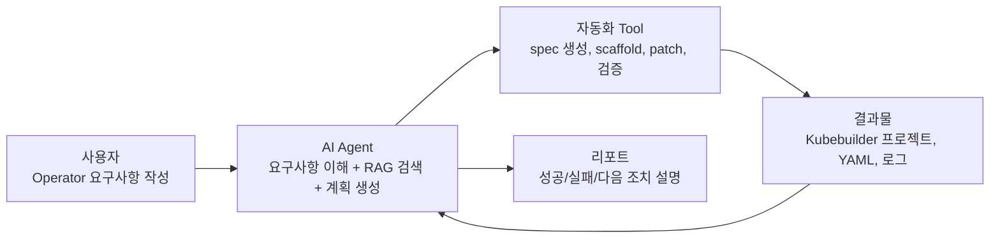
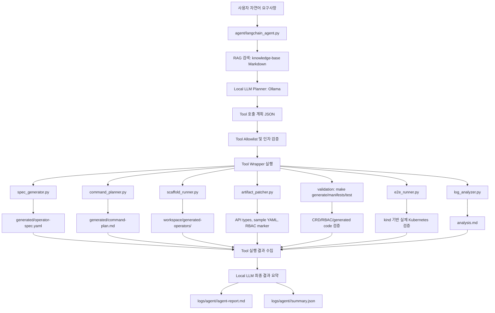

# Kubebuilder Operator AI Agent

Kubebuilder 기반 Kubernetes Operator 개발을 자동화하기 위한 로컬 실행형 AI Agent 프로젝트입니다.

이 프로젝트는 단순히 AI에게 코드 작성을 질문하는 챗봇이 아니라, 자연어 요구사항 분석부터 Kubebuilder 개발 절차 안내, 산출물 생성, 검증 명령 실행, 실패 로그 분석, 수정 방향 제시까지 이어지는 생성·검증 중심 개발지원 시스템을 목표로 합니다.

## 그림으로 먼저 이해하기

자세한 설명을 읽기 전에 이 그림 하나로 먼저 보면 됩니다.



한 문장으로 말하면:

```text
사용자가 만들고 싶은 Operator를 자연어로 적으면,
AI Agent가 관련 문서를 찾아보고,
기존 자동화 Tool을 안전하게 호출해서,
Operator 프로젝트와 검증 결과를 만들고,
마지막에 사람이 이해할 수 있는 리포트를 남깁니다.
```

처음 이해할 때는 아래 문서를 먼저 보는 것이 좋습니다.

- [그림 중심 전체 흐름 설명](docs/visual-overview.md)

## 과제명

Kubebuilder 기반 Operator 개발 자동화를 위한 AI 기반 생성·검증 시스템 구축

## 대상 사용자

- Kubebuilder 기반 Kubernetes Operator를 설계·개발하는 내부 개발자
- CRD, Controller, RBAC, Manifest, 테스트를 작성하는 플랫폼 엔지니어
- GitHub, Jenkins, Harbor, Argo CD 기반 개발·검증·배포 체계를 사용하는 조직

## 핵심 목표

- 자연어 요구사항을 Operator 개발 요구사항으로 구조화합니다.
- AI Agent가 Kubebuilder 개발 순서를 단계별로 안내합니다.
- CRD, Controller, RBAC, Manifest, 테스트 초안 등 필수 산출물 생성을 지원합니다.
- `make generate`, `make manifests`, `make test` 등 검증 명령 실행 흐름을 정의합니다.
- 실패 로그를 분석하여 원인과 해결 방향을 제시합니다.
- 필요 시 특정 산출물만 부분 수정하거나 재생성할 수 있는 구조를 지향합니다.
- GitHub, Jenkins, Harbor, Argo CD 연계까지 확장 가능한 구조로 설계합니다.

## 한눈에 보는 전체 구조

이 프로젝트는 크게 세 계층으로 구성됩니다.

| 계층 | 역할 | 대표 파일 |
| --- | --- | --- |
| AI Agent 계층 | 사용자의 자연어 요구사항을 읽고, RAG 문서를 검색하고, Local LLM이 실행 계획과 결과 판단을 생성 | `agent/langchain_agent.py`, `agent/llm/*`, `agent/rag/retriever.py` |
| Tool 계층 | Agent가 호출하는 실제 자동화 도구. 스펙 생성, 실행 계획 생성, scaffold, patch, 검증, 로그 분석을 담당 | `agent/tools/*.py` |
| 산출물/검증 계층 | 생성된 spec, Kubebuilder 프로젝트, 실행 로그, Agent 리포트를 저장 | `generated/`, `workspace/`, `logs/` |

핵심 개념은 다음과 같습니다.

- **LLM은 명령을 직접 실행하지 않습니다.** LLM은 요구사항을 해석하고 어떤 Tool을 호출할지 계획합니다.
- **실제 명령 실행은 Tool wrapper가 담당합니다.** 허용된 Tool만 실행하고, 위험한 명령은 실행하지 않습니다.
- **기본은 dry-run입니다.** 실제 scaffold, patch, e2e 실행은 사용자가 `--execute`를 명시할 때만 수행합니다.
- **RAG 문서는 모두 로컬 Markdown입니다.** `knowledge-base/` 아래 문서를 검색해 LLM 입력에 포함합니다.
- **LLM provider는 Ollama local만 사용합니다.** 내부 코드, YAML, Kubernetes 로그를 외부 API로 보내지 않는 구조입니다.

## 전체 흐름도

사용자가 보는 가장 큰 흐름은 다음과 같습니다.

```text
자연어 요구사항
  -> RAG 문서 검색
  -> Local LLM planner
  -> Tool 호출 계획 생성
  -> Tool allowlist / 인자 검증
  -> 기존 자동화 Tool 실행
  -> Tool 실행 결과 수집
  -> Local LLM 최종 평가
  -> report / summary / 로그 저장
```

GitHub에서 Mermaid가 보이는 환경이라면 아래 흐름도도 함께 확인할 수 있습니다.



## 사용자 입장에서 보는 실행 흐름

초보자가 이 시스템을 사용할 때는 아래 순서로 이해하면 됩니다.

| 단계 | 사용자가 하는 일 | Agent/Tool이 하는 일 | 생성되는 결과 |
| --- | --- | --- | --- |
| 1 | “어떤 Operator를 만들고 싶은지” 자연어로 작성 | requirement 파일을 읽음 | `requirements/*.txt` |
| 2 | Agent dry-run 실행 | RAG 검색 후 LLM이 요구사항 요약, 누락 정보, Tool 계획 생성 | `logs/agent/<timestamp>/llm-output.json` |
| 3 | 구조화 스펙 생성 | `spec_generator.py`가 requirement를 `operator-spec.yaml`로 변환 | `generated/<kind>-operator-spec.yaml` |
| 4 | 실행 계획 생성 | `command_planner.py`가 Kubebuilder 명령 순서와 목적을 Markdown으로 작성 | `generated/<kind>-command-plan.md` |
| 5 | scaffold dry-run | `scaffold_runner.py`가 실제 실행될 Kubebuilder 명령을 미리 보여줌 | dry-run 출력, `logs/scaffold/*` |
| 6 | scaffold execute | `kubebuilder init`, `kubebuilder create api`, `make generate`, `make manifests`, `make test` 실행 | `workspace/generated-operators/<operator>` |
| 7 | 산출물 보정 | `artifact_patcher.py`가 spec/status 필드, sample YAML, RBAC marker 반영 | API 타입, sample YAML, RBAC marker |
| 8 | make 검증 | `make generate`, `make manifests`, `make test`로 컴파일/manifest 검증 | 검증 로그 |
| 9 | e2e 검증 | kind 클러스터에서 CRD 설치, CR 생성, 하위 리소스 생성 확인 | `logs/e2e/<timestamp>/summary.json` |
| 10 | 로그 분석 | `log_analyzer.py`와 LLM이 실패/경고/성공을 설명 | `analysis.md`, `agent-report.md` |
| 11 | 실패 복구 계획 | LLM recovery plan을 policy validator가 검증 | `validated-recovery-plan.json` |

## Agent 내부 처리 흐름

`agent/langchain_agent.py`는 전체 오케스트레이터입니다. 내부에서는 다음 순서로 동작합니다.

```text
1. 입력 확인
   - --requirement 또는 --analyze-log 확인
   - --profile 확인
   - --mode dry-run 또는 execute 확인

2. RAG 검색
   - knowledge-base/kubebuilder-guides
   - knowledge-base/troubleshooting
   - knowledge-base/examples

3. Local LLM 호출
   - requirement summary 생성
   - missing information 점검
   - planned steps 생성
   - toolCalls 생성
   - risks / nextActions 생성

4. Tool 호출 검증
   - 허용 Tool인지 확인
   - workspace 경로가 repo 밖인지 확인
   - --execute가 없으면 변경 작업은 dry-run으로 강제
   - 잘못된 Tool은 rejectedToolCalls에 기록

5. Tool 실행
   - spec_generator
   - command_planner
   - scaffold_runner
   - artifact_patcher
   - validation
   - e2e_runner
   - log_analyzer

6. 최종 LLM 평가
   - Tool exitCode 확인
   - 생성 산출물 확인
   - warning/error 요약
   - beginnerSummary 생성

7. 실패 시 recovery planning
   - failure-context.json 생성
   - troubleshooting RAG 검색
   - LLM recovery plan 생성
   - Recovery Policy Validator로 allowlist/근본 원인 검증
   - 사용자 승인 전에는 복구 Tool 실행 안 함
```

## Tool별 역할

| Tool | 파일 | 입력 | 출력 | 실제 변경 여부 |
| --- | --- | --- | --- | --- |
| Requirement Planner | `agent/langchain_agent.py` | requirement, profile | LLM 계획, Tool 호출 계획 | 기본적으로 변경 없음 |
| RAG Retriever | `agent/rag/retriever.py` | 검색어 | 관련 Markdown 문서 발췌 | 변경 없음 |
| LLM Client | `agent/llm/client.py` | prompt JSON | LLM JSON 응답 | 변경 없음 |
| Spec Generator | `agent/tools/spec_generator.py` | `requirements/*.txt` | `generated/*-operator-spec.yaml` | 파일 생성 |
| Command Planner | `agent/tools/command_planner.py` | `operator-spec.yaml` | `generated/*-command-plan.md` | 파일 생성 |
| Scaffold Runner | `agent/tools/scaffold_runner.py` | `operator-spec.yaml` | Kubebuilder 프로젝트 | `--execute`일 때만 생성 |
| Artifact Patcher | `agent/tools/artifact_patcher.py` | spec, project, profile | API 타입, sample, RBAC 보정 | `--execute`일 때만 수정 |
| Validation Tool | `agent/tools/langchain_wrappers.py` 내부 | project, targets | `make generate/manifests/test` 결과 | 빌드 산출물 생성 가능 |
| E2E Runner | `agent/tools/e2e_runner.py` | project, sample, profile | kind e2e 결과 | `--execute`일 때만 클러스터 조작 |
| Log Analyzer | `agent/tools/log_analyzer.py` | `logs/*/<timestamp>` | `analysis.md` | 분석 파일 생성 |
| Recovery Validator | `agent/langchain_agent.py` 내부 | raw recovery plan, failure context | validated/rejected recovery plan | 복구 Tool 자동 실행 안 함 |

## 산출물 위치

실행 후 어디를 보면 되는지 헷갈릴 때는 이 표를 보면 됩니다.

| 위치 | 의미 | 예시 |
| --- | --- | --- |
| `requirements/` | 사용자가 작성한 자연어 요구사항 | `requirements/appconfig.txt` |
| `profiles/` | 선택적 profile hint, fixture 기본값, e2e 규칙, 검증 규칙 | `profiles/*.yaml` |
| `knowledge-base/` | RAG 검색에 쓰이는 로컬 지식 문서 | `knowledge-base/kubebuilder-guides/basic-flow.md` |
| `generated/` | Agent가 만든 구조화 스펙과 실행 계획 | `generated/appconfig-operator-spec.yaml` |
| `workspace/generated-operators/` | Kubebuilder 프로젝트 실제 생성 위치 | `workspace/generated-operators/app-config-operator` |
| `logs/agent/` | Agent 실행 리포트, LLM 입출력, Tool 결과 | `logs/agent/<timestamp>/agent-report.md` |
| `logs/scaffold/` | scaffold_runner 실행 로그 | `logs/scaffold/<timestamp>/summary.json` |
| `logs/patch/` | artifact_patcher 실행 로그 | `logs/patch/<timestamp>/summary.json` |
| `logs/e2e/` | kind e2e 실행 로그 | `logs/e2e/<timestamp>/summary.json` |

## 주요 로그 파일 의미

Agent를 실행하면 `logs/agent/<timestamp>/` 아래에 여러 파일이 생깁니다.

| 파일 | 의미 |
| --- | --- |
| `agent-report.md` | 사람이 읽는 최종 리포트 |
| `summary.json` | 전체 실행 결과를 기계가 읽기 좋은 형태로 저장 |
| `llm-input.json` | LLM에 전달한 입력 |
| `llm-output.json` | LLM이 생성한 JSON 계획 또는 판단 |
| `llm-raw-output.txt` | 로컬 모델의 원문 응답 |
| `retrieved-docs.json` | RAG로 검색된 문서 목록 |
| `initial-plan.json` | 최초 LLM Tool 계획 |
| `validated-tool-calls.json` | allowlist 검증을 통과한 Tool 호출 |
| `rejected-tool-calls.json` | 거부된 Tool 호출 |
| `tool-results.json` | 실제 Tool 실행 결과 |
| `final-llm-input.json` | Tool 결과를 다시 LLM에 전달한 입력 |
| `final-llm-output.json` | Tool 실행 후 LLM의 최종 판단 |
| `failure-context.json` | 실패 시 실패 단계, 명령, stdout/stderr 요약 |
| `validated-recovery-plan.json` | policy validator가 보정한 최종 복구 계획 |
| `rejected-recovery-tool-calls.json` | 거부된 복구 Tool과 이유 |

## 성공 흐름과 실패 흐름

정상 흐름은 다음과 같습니다.

```text
Requirement
  -> LLM 계획 성공
  -> Tool 검증 성공
  -> spec 생성 성공
  -> command plan 생성 성공
  -> scaffold 성공
  -> artifact patch 성공
  -> make generate/manifests/test 성공
  -> final LLM 판단: succeeded
```

실패 흐름은 다음과 같습니다.

```text
Tool 실행 실패
  -> failedTool / failedStep / exitCode 수집
  -> stdout/stderr 마지막 100줄 저장
  -> troubleshooting RAG 검색
  -> LLM recovery plan 생성
  -> Recovery Policy Validator가 allowlist와 원인 관련성 검증
  -> validatedRecoveryToolCalls 생성
  -> status: waiting-for-user-approval
```

중요한 점은 **복구 계획은 자동 실행되지 않는다**는 것입니다. Agent는 “무엇을 고쳐야 하는지”와 “어떤 Tool을 다시 실행해야 하는지”까지만 제안하고, 실제 수정은 사용자 승인 후에 진행합니다.

## 대표 사용 흐름

### 흐름 A: 사용자의 자연어 요구사항으로 dry-run

사용자는 특정 예시에 맞출 필요 없이 만들고 싶은 Operator를 자연어로 작성합니다. `--profile`은 선택 사항이며, 제공되더라도 Agent가 참고하는 hint일 뿐입니다.

대충 쓴 문장을 requirement 파일로 정리하려면 먼저 질문형 builder를 사용할 수 있습니다.

```bash
python3 agent/requirement_builder.py \
  --draft "비밀번호와 토큰 값을 Kubernetes Secret으로 관리하는 Operator가 필요해" \
  --output requirements/secret-sync.txt \
  --assume-defaults \
  --print-questions
```

`--assume-defaults`를 빼면 부족한 값을 터미널에서 직접 물어봅니다. builder는 완성된 requirement 파일과 함께 “사용자에게 확인해야 할 질문”을 출력합니다.

```bash
python3 agent/langchain_agent.py \
  --requirement requirements/my-operator.txt \
  --mode dry-run
```

확인할 것:

- `logs/agent/<timestamp>/agent-report.md`
- `logs/agent/<timestamp>/llm-output.json`
- `generated/<kind>-operator-spec.yaml`
- `generated/<kind>-command-plan.md`

### 흐름 B: requirement + optional profile hint

profile은 “이 Operator가 어떤 패턴과 비슷한지”를 알려주는 보조 정보입니다. profile이 있어도 Operator의 kind, field, controller 책임은 현재 requirement가 우선합니다.

```bash
python3 agent/langchain_agent.py \
  --requirement requirements/my-operator.txt \
  --profile profiles/similar-pattern.yaml \
  --mode dry-run
```

### 흐름 C: 실제 scaffold/patch/validation

실제 Kubebuilder 프로젝트 생성과 보정까지 진행하려면 `--mode execute --execute`를 함께 사용합니다.

```bash
python3 agent/langchain_agent.py \
  --requirement requirements/my-operator.txt \
  --mode execute \
  --execute
```

확인할 것:

- `workspace/generated-operators/<project-name>`
- `api/<version>/*_types.go`
- `config/samples/*_<kind>.yaml`
- `config/rbac/role.yaml`
- `make generate`, `make manifests`, `make test` 결과

### 흐름 D: 실행 로그 AI 분석

이미 생성된 scaffold/patch/e2e 로그를 분석하고 warning, failure, recovery 방향을 판단합니다.

```bash
python3 agent/langchain_agent.py \
  --analyze-log logs/e2e/20260607-213346
```

### 내부 fixture

`requirements/appconfig.txt`와 `profiles/appconfig.yaml`은 사용자에게 특정 Operator를 강요하기 위한 기준이 아닙니다. 신뢰성 테스트, kind lifecycle 검증, 회귀 검증을 빠르게 반복하기 위한 내부 fixture입니다.

확인할 것:

- `decision`: `succeeded-with-warning`
- GPU Pending이 Controller 오류가 아니라 kind 환경 warning으로 분류되는지
- `recommendedFixes`
- `explanationForBeginner`

### 시나리오 D: 실패 복구 계획 생성

잘못된 타입, RBAC 누락, PVC 없음 같은 실패가 발생하면 Agent가 복구 계획을 생성합니다.

```text
예: brokenValue:notatype
  -> make generate 실패
  -> classification: invalid-field-type
  -> requirement_editor -> spec_generator -> artifact_patcher -> validation 순서 제안
  -> controller-gen, go_version_checker 같은 부적절한 Tool은 거부
  -> status: waiting-for-user-approval
```

## 1차 MVP 범위

1차 MVP는 전체 자동화 시스템을 한 번에 구현하지 않고, 로컬 실행형 Agent 흐름을 검증하는 데 집중합니다.

- 현재 로컬 개발환경 점검
- `go`, `docker`, `kubectl`, `kind`, `helm`, `kubebuilder`, `kustomize`, `git` 설치 여부 확인
- Kubebuilder scaffold 생성 흐름 정리
- 예시 API 생성 흐름 정리
- CRD, Controller, RBAC, Manifest 생성 절차 문서화
- `make generate` 실행 및 결과 확인 흐름 정리
- `make manifests` 실행 및 결과 확인 흐름 정리
- `make test` 실행 및 결과 확인 흐름 정리
- 실패 로그 분석 기준 정리
- 프로젝트 목표, 아키텍처, 데모 시나리오, 개발 계획 문서화

## 디렉터리 구조

```text
/home/ch0618/k8sagent
├── README.md
├── PROJECT_GOAL.md
├── ARCHITECTURE.md
├── DEMO_SCENARIO.md
├── DEVELOPMENT_PLAN.md
├── docs/
├── knowledge-base/
├── agent/
│   ├── langchain_agent.py
│   ├── llm/
│   ├── rag/
│   ├── tools/
│   ├── prompts/
│   ├── workflows/
│   └── policies/
├── profiles/
├── requirements/
├── scripts/
├── examples/
├── generated/
├── logs/
├── workspace/
└── web/
```

## 디렉터리 역할

| 경로 | 목적 |
| --- | --- |
| `docs` | 요구사항, Agent 흐름, 검증 흐름, 오류 대응 가이드 문서 |
| `knowledge-base` | RAG 검색에 사용하는 Kubebuilder 가이드, troubleshooting, 예시 문서 |
| `agent/langchain_agent.py` | 전체 Agent 오케스트레이터 |
| `agent/llm` | Ollama local LLM client, prompt, planner |
| `agent/rag` | 로컬 Markdown RAG 검색기 |
| `agent/tools` | 기존 CLI 자동화 도구와 Tool wrapper |
| `agent/prompts` | 요구사항 분석, 생성, 검증 분석, 오류 진단용 프롬프트 초안 |
| `agent/workflows` | 환경 점검, scaffold 생성, generate/manifests/test 흐름 정의 |
| `agent/policies` | 명령 실행, 파일 수정, 부분 재생성 정책 |
| `profiles` | AppConfig, TrainingJob, RedisCache 등 profile과 sample/e2e 규칙 |
| `requirements` | 사용자가 작성하는 자연어 Operator 요구사항 |
| `scripts` | 이후 로컬 환경 점검 및 검증 실행 스크립트 위치 |
| `examples` | 샘플 Operator 요구사항 및 데모 입력 예시 |
| `generated` | Agent가 생성하는 중간 산출물 또는 스펙 저장 위치 |
| `logs` | 명령 실행 결과와 실패 로그 저장 위치 |
| `workspace` | 실제 Kubebuilder 프로젝트가 생성될 작업 공간 |
| `web` | 초보자 입력과 심사용 시연을 위한 Web UI |

## Core Agent와 Profile 구조

이 프로젝트는 TrainingJob 전용 생성기가 아니라 Kubebuilder 기반 Operator 개발 절차를 자동화하는 범용 Agent 시스템입니다.

현재 구조는 다음 두 계층으로 나눕니다.

| 계층 | 역할 | 현재 예 |
| --- | --- | --- |
| Core Agent | Operator 종류와 무관한 공통 절차를 수행 | `spec_generator.py`, `command_planner.py`, `scaffold_runner.py` |
| Profile/Example | 특정 Operator 패턴의 sample, patch, e2e, warning 규칙을 정의 | `profiles/trainingjob.yaml`, `profiles/rediscache.yaml` |

TrainingJob은 GPU 학습 도메인을 대상으로 한 MVP 검증용 profile입니다. RedisCache는 StatefulSet/Service 기반 Operator로 확장하기 위한 예시 profile입니다.

현재 `artifact_patcher.py`, `e2e_runner.py`, `log_analyzer.py`에는 TrainingJob profile 로직이 일부 섞여 있습니다. 향후 리팩터링에서는 이 로직을 `profiles/` 또는 plugin 계층으로 분리하여 RedisCache와 다른 Operator profile도 같은 core pipeline을 재사용할 수 있게 합니다.

전체 파이프라인은 다음과 같습니다.

```text
requirement
  -> operator-spec.yaml
  -> command plan
  -> Kubebuilder scaffold
  -> artifact patch
  -> make generate/manifests/test
  -> kind e2e
  -> log analysis
```

리팩터링 계획은 [docs/refactoring-plan.md](docs/refactoring-plan.md)를 참고합니다.

## 시연 문서

현재 MVP 상태를 기준으로 심사/시연에서 사용할 수 있는 문서를 제공합니다.

- [TrainingJob 데모 시나리오](docs/demo-scenario-trainingjob.md)
- [발표자용 데모 스크립트](docs/demo-script.md)
- [현재 MVP 상태](docs/current-mvp-status.md)
- [데모 체크리스트](docs/demo-checklist.md)

## 현재 상태

현재 단계에서는 RedisCache Operator를 1차 MVP 샘플로 생성하고, 요구사항 구조화부터 Kubebuilder 산출물 확인, CRD 생성 검증, 기본 컴파일 검증까지 실행할 수 있는 데모 흐름을 제공합니다.

## RedisCache MVP 데모 실행

다음 명령으로 1차 MVP 흐름을 한 번에 확인할 수 있습니다.

```bash
./scripts/demo-rediscache-mvp.sh
```

이 스크립트는 다음을 확인합니다.

- 로컬 개발환경 점검
- `generated/rediscache-operator-spec.yaml` 구조화 스펙 확인
- `workspace/redis-cache-operator` Kubebuilder 산출물 확인
- `RedisCache` Spec/Status 타입 정의 확인
- `controller-gen` 기반 DeepCopy 및 CRD manifest 생성
- CRD schema에 `size`, `image`, `storageSize`, `phase`, `readyReplicas`, `message` 필드 포함 여부 확인
- `go test ./api/... ./cmd/... ./test/utils` 기본 컴파일 검증

실행 환경에 따라 Docker 권한 경고가 표시될 수 있습니다. 1차 MVP scaffold 검증은 Docker daemon 없이도 계속 진행되며, kind 클러스터 기반 e2e 검증 단계에서 Docker 연결이 필요합니다.

## Agent CLI 골격

자연어 요구사항을 구조화 스펙으로 변환하는 CLI 골격을 제공합니다.

범용 요구사항 템플릿을 기준으로 작성한 파일을 `operator-spec.yaml`로 변환할 수 있습니다.

```bash
cp requirements/template.txt requirements/my-operator.txt
# requirements/my-operator.txt 내용을 실제 Operator 요구사항으로 수정
python3 agent/tools/spec_generator.py requirements/my-operator.txt
```

기본 출력 경로는 다음 형식입니다.

```text
generated/<kind 소문자>-operator-spec.yaml
```

예를 들어 `kind`가 `TrainingJob`이면 `generated/trainingjob-operator-spec.yaml`이 생성됩니다. 변환 결과에는 `metadata`, `project`, `api`, `specFields`, `statusFields`, `controller`, `rbac`, `validation`, `warnings`, `errors`가 포함됩니다.

템플릿과 작성 가이드는 다음 문서를 참고합니다.

- [docs/operator-requirement-template.md](docs/operator-requirement-template.md)
- [docs/requirement-writing-guide.md](docs/requirement-writing-guide.md)
- [docs/spec-schema.md](docs/spec-schema.md)

생성된 스펙을 기준으로 Kubebuilder 실행 계획 문서를 만들 수 있습니다.

```bash
python3 agent/tools/command_planner.py \
  --input generated/trainingjob-operator-spec.yaml \
  --output generated/trainingjob-command-plan.md
```

이 단계는 실제 명령을 실행하지 않고, `kubebuilder init`, `kubebuilder create api`, `make generate`, `make manifests`, `make test`를 어떤 순서와 목적으로 실행할지 Markdown 문서로 생성합니다.

계획을 검토한 뒤 scaffold runner로 실행 예정 명령을 확인할 수 있습니다. 기본 동작은 dry-run입니다.

```bash
python3 agent/tools/scaffold_runner.py \
  --input generated/trainingjob-operator-spec.yaml \
  --workspace workspace/generated-operators \
  --dry-run
```

실제 실행 전에 로컬 도구, 스펙 필수값, 작업 디렉터리 상태를 preflight로 점검할 수 있습니다.

```bash
python3 agent/tools/scaffold_runner.py \
  --input generated/trainingjob-operator-spec.yaml \
  --workspace workspace/generated-operators \
  --preflight
```

preflight 결과는 `logs/scaffold/<timestamp>/preflight.json`에 저장됩니다. 실패 항목이 있으면 `--execute` 실행 전 단계에서 중단합니다.

실제 Kubebuilder scaffold를 수행하려면 `--execute`를 명시합니다.

```bash
python3 agent/tools/scaffold_runner.py \
  --input generated/trainingjob-operator-spec.yaml \
  --workspace workspace/generated-operators \
  --execute
```

대상 프로젝트 디렉터리가 이미 있으면 기본적으로 중단합니다. 기존 디렉터리를 삭제하고 다시 만들 때만 `--force`를 함께 사용합니다. 실제 실행 로그는 `logs/scaffold/<timestamp>/` 아래에 저장됩니다.

생성된 Kubebuilder 프로젝트에 스펙 필드, 샘플 CR, RBAC marker를 반영하려면 artifact patcher를 사용합니다. 기본 동작은 dry-run이며 수정 전후 diff만 출력합니다.

```bash
python3 agent/tools/artifact_patcher.py \
  --input generated/trainingjob-operator-spec.yaml \
  --project workspace/generated-operators/trainingjob-operator \
  --dry-run
```

TrainingJob profile의 sample 기본값을 사용하려면 `--profile`을 함께 전달합니다.

```bash
python3 agent/tools/artifact_patcher.py \
  --input generated/trainingjob-operator-spec.yaml \
  --project workspace/generated-operators/trainingjob-operator \
  --profile profiles/trainingjob.yaml \
  --dry-run
```

실제 파일 수정을 수행하려면 `--execute`를 명시합니다. `make generate`, `make manifests`, `make test`는 별도 검증 단계에서 실행합니다.

```bash
python3 agent/tools/artifact_patcher.py \
  --input generated/trainingjob-operator-spec.yaml \
  --project workspace/generated-operators/trainingjob-operator \
  --execute
```

실행 로그와 summary는 `logs/patch/<timestamp>/` 아래에 저장됩니다.

생성된 Operator가 실제 Kubernetes 클러스터에서 동작하는지 kind 기반 e2e runner로 확인할 수 있습니다. 기본 동작은 dry-run입니다.

```bash
python3 agent/tools/e2e_runner.py \
  --project workspace/generated-operators/trainingjob-operator \
  --cluster-name trainingjob-e2e \
  --sample workspace/generated-operators/trainingjob-operator/config/samples/ml_v1alpha1_trainingjob.yaml \
  --dry-run
```

실제 kind 클러스터와 kubectl 명령을 사용하려면 `--execute`를 명시합니다.

```bash
python3 agent/tools/e2e_runner.py \
  --project workspace/generated-operators/trainingjob-operator \
  --cluster-name trainingjob-e2e \
  --sample workspace/generated-operators/trainingjob-operator/config/samples/ml_v1alpha1_trainingjob.yaml \
  --execute
```

기존 sample 리소스를 지우고 새 Job spec을 깨끗하게 검증하려면 `--clean`을 함께 사용합니다. 기본적으로 PVC는 유지하며, PVC까지 삭제하려면 `--delete-pvc`를 추가합니다.

```bash
python3 agent/tools/e2e_runner.py \
  --input generated/trainingjob-operator-spec.yaml \
  --clean \
  --dry-run
```

```bash
python3 agent/tools/e2e_runner.py \
  --input generated/trainingjob-operator-spec.yaml \
  --clean \
  --execute
```

TrainingJob profile 값을 명시적으로 사용하려면 `--profile`을 함께 전달합니다.

```bash
python3 agent/tools/e2e_runner.py \
  --input generated/trainingjob-operator-spec.yaml \
  --profile profiles/trainingjob.yaml \
  --clean \
  --dry-run
```

e2e 로그와 summary는 `logs/e2e/<timestamp>/` 아래에 저장됩니다.

저장된 scaffold, patch, e2e 로그는 log analyzer로 요약할 수 있습니다. analyzer는 `summary.json`을 먼저 읽고, 실패 단계가 있으면 해당 stdout/stderr 로그를 함께 확인하여 실패 원인과 수정 방향을 Markdown으로 생성합니다.

```bash
python3 agent/tools/log_analyzer.py \
  --log-dir logs/e2e/20260607-213346
```

분석 결과는 기본적으로 입력한 로그 디렉터리의 `analysis.md`에 저장됩니다. 예를 들어 e2e 성공 로그라면 전체 실행 결과, warning, Job spec validation 결과, summary 기반 재실행 권장 명령을 요약합니다. 실패 로그라면 `failedStep`, 관련 명령, 오류 유형, 근거 로그, 해결 방향을 함께 정리합니다.

초보자용 대화형 입력:

```bash
./scripts/agent-requirement-cli.py interactive \
  -o generated/training-job-operator-spec.yaml \
  --print-commands
```

대화형 모드는 다음 순서로 질문합니다.

- 관리하려는 대상
- Custom Resource 이름
- domain, group, version
- 사용자가 입력할 값
- 사용자가 보고 싶은 상태
- Operator가 생성/관리할 Kubernetes 리소스
- 입력값과 생성 리소스의 매핑
- status 갱신 기준

파일 기반 입력:

```bash
./scripts/agent-requirement-cli.py \
  -i examples/rediscache-requirement.txt \
  -o generated/redis-cache-operator-spec.yaml \
  --print-commands
```

이 CLI는 입력 요구사항에서 `domain`, `group`, `version`, `kind`, `spec`, `status`, `controller` 정보를 추출하여 YAML 스펙을 생성하고, 실행할 Kubebuilder 명령 후보를 출력합니다.

생성 결과 예:

```text
generated/redis-cache-operator-spec.yaml
```

현재 CLI는 LLM을 붙이기 전의 MVP 골격이며, 명시적으로 작성된 요구사항 문장을 규칙 기반으로 파싱합니다. 이후 단계에서 LLM 기반 Semantic Parsing, RAG 검색, 검증 로그 분석 Agent와 연결할 수 있습니다.

## LangChain 기반 Agent Orchestrator

기존 CLI 도구 위에 LangChain-style Agent Orchestrator를 추가했습니다.

본 시스템은 LLM planner 기반 Agent 구조를 사용합니다. Agent는 요구사항을 요약하고, `knowledge-base` 문서를 검색한 뒤, LLM planner가 실행 계획을 JSON으로 생성하고, 기존 CLI 도구를 Tool wrapper로 호출합니다.

RAG는 로컬 Markdown `knowledge-base`를 대상으로 동작합니다. 현재는 keyword 검색을 fallback으로 유지하면서, Ollama embedding과 FAISS index를 사용하는 Hybrid RAG를 지원합니다.

```text
knowledge-base Markdown
  -> chunk 분할
  -> Ollama embedding
  -> FAISS index
  -> vector search + keyword search
  -> optional Local LLM reranker
  -> Top 3 context
  -> LLM planner 입력
```

CPU 노트북 기본값은 reranker를 끈 Hybrid 검색입니다.

```bash
export RAG_MODE=hybrid
export RAG_RERANK_ENABLED=false
```

reranker까지 검증할 때만 별도 모드로 실행합니다.

```bash
export RAG_MODE=hybrid-rerank
export RAG_RERANK_ENABLED=true
export LOCAL_LLM_TIMEOUT_SECONDS=120
```

RAG index 생성:

```bash
ollama pull nomic-embed-text

python3 agent/rag/build_index.py \
  --knowledge-base knowledge-base \
  --index-dir knowledge-base/.index \
  --rebuild
```

검색 테스트:

```bash
python3 agent/rag/retriever.py \
  --query "ConfigMap을 생성하는 AppConfig Operator" \
  --mode hybrid \
  --json
```

index가 없거나 embedding model이 준비되지 않은 개발 환경에서는 keyword fallback을 사용할 수 있으며, fallback 여부는 `logs/agent/<timestamp>/selected-context.json`과 `summary.json`에 기록됩니다.

MVP는 안전을 위해 기본 dry-run 중심입니다. 실제 scaffold, patch, e2e 실행은 별도 `--execute`가 명시될 때만 수행합니다.

LLM planner는 Ollama 기반 local provider만 지원합니다. 사내 예제 코드, Kubernetes 로그, YAML 산출물, 오류 로그를 외부 API로 보내지 않고 로컬 환경 안에서 처리하기 위한 구조입니다. Ollama 서버나 모델 호출에 실패하면 다른 provider로 대체하지 않고 명확한 오류를 출력합니다.

```bash
pip install -r requirements.txt

# Linux/WSL에서 Ollama가 없다면 먼저 설치합니다.
curl -fsSL https://ollama.com/install.sh | sh

ollama pull qwen2.5-coder:3b
ollama run qwen2.5-coder:3b

export LOCAL_LLM_BASE_URL=http://localhost:11434/v1
export LOCAL_LLM_MODEL=qwen2.5-coder:3b
```

`LOCAL_LLM_BASE_URL`을 지정하지 않으면 기본값은 `http://localhost:11434/v1`입니다. `LOCAL_LLM_MODEL`을 지정하지 않으면 기본값은 `qwen2.5-coder:3b`입니다.

대표 실행 예시 1: requirement 기반 dry-run

```bash
python3 agent/langchain_agent.py \
  --requirement requirements/my-operator.txt \
  --mode dry-run
```

CPU 환경에서 개발 피드백을 빠르게 보고 싶다면 `fast` run-level을 사용합니다. 이 모드는 최초 LLM 계획과 Tool dry-run은 수행하지만, Tool 결과를 다시 LLM에 보내는 최종 평가 단계는 규칙 기반 요약으로 대체합니다.

```bash
python3 agent/langchain_agent.py \
  --requirement requirements/my-operator.txt \
  --mode dry-run \
  --run-level fast
```

현재 기본값은 빠른 피드백을 위해 `--run-level fast`입니다. 정밀한 최종 LLM 평가가 필요하면 `--run-level standard`를 사용합니다. 명시적으로 최종 LLM 평가만 건너뛰려면 `--skip-final-llm-evaluation`을 사용할 수 있습니다.

같은 requirement, profile hint, RAG 문서, local model 조합은 기본적으로 LLM planning cache를 사용합니다. 캐시는 `.cache/agent/llm-plans/` 아래에 저장됩니다. 새 모델 응답을 강제로 받고 싶으면 `--refresh-cache`, 캐시를 끄고 싶으면 `--no-cache`를 사용합니다.

로컬 모델 출력 길이는 기본적으로 짧게 제한합니다. 필요하면 다음 환경변수로 조정합니다.

```bash
export LOCAL_LLM_MAX_TOKENS=700
export AGENT_REQUIREMENT_RAG_LIMIT=2
```

cache hit 여부는 실행 초반의 `Planner cache: hit|miss`와 `agent-report.md`의 `Planner cache hit`에서 확인할 수 있습니다.

Agent 실행 결과에는 다음 항목이 포함됩니다.

- Requirement Summary
- Requirement Intent
- Missing Information Check
- Retrieved Knowledge
- LLM Planner Output
- AI Reasoning
- RAG Evidence Used By LLM
- Tool Call Plan From LLM
- Profile Hint
- Tool Execution Results
- Generated Files
- Warnings / Errors
- Next Recommended Actions

특히 `RAG Evidence Used By LLM` 섹션은 검색된 문서가 어떤 판단에 사용되었는지 보여줍니다. 예를 들어 `rbac-marker.md`가 RBAC 권한 추론에 사용되었는지, `reconcile-pattern.md`가 Controller 동작 계획에 사용되었는지 확인할 수 있습니다.

근거와 안전장치만 따로 확인하려면 [Agent Evidence And Safety](docs/agent-evidence-and-safety.md)를 봅니다. Agent 실행 시 `evidence-trace.json`과 `safety-evaluation.json`이 함께 생성되어, RAG 문서 선택 이유, LLM 판단 근거, Tool allowlist 검증, dry-run/execute gate, recovery 승인 대기 상태를 확인할 수 있습니다.

특정 예시에 종속되지 않는 Agent core 방향은 [Generic Agent Core](docs/generic-agent-core.md)를 봅니다. 여기에는 AppConfig가 내부 fixture이고, profile은 hint-only라는 기준이 정리되어 있습니다.

오프라인/내부망 환경에서 모델을 어떻게 사용할지는 [Local Model Usage Policy](docs/local-model-usage-policy.md)를 봅니다. 이 문서는 Ollama local model, run-level, planning cache, Tool 실행 안전 원칙을 정리합니다.

기본은 dry-run이며, 실제 scaffold, patch, e2e 변경 작업은 `--execute`가 명시되지 않으면 수행하지 않습니다. 실행 결과는 `logs/agent/<timestamp>/summary.json`과 `logs/agent/<timestamp>/agent-report.md`에 저장됩니다.

성능 병목은 `logs/agent/<timestamp>/timings.json`과 `agent-report.md`의 `Timings` 섹션에서 확인합니다. 주요 항목은 RAG 검색 시간, 최초 LLM 계획 시간, Tool 검증 시간, Tool 실행 시간, 최종 LLM 평가 시간, 전체 시간입니다.

실제 LLM 연결 여부는 다음 파일로 확인합니다.

```bash
ls -al logs/agent
cat logs/agent/<timestamp>/llm-output.json
cat logs/agent/<timestamp>/agent-report.md
```

`llm-output.json`에는 모델이 생성한 요구사항 요약, 누락 정보, RAG 근거, Tool 호출 계획이 저장됩니다. `llm-raw-output.txt`에는 로컬 모델의 원문 응답이 저장됩니다. 이 파일들이 심사에서 “모델이 실제로 판단했다”는 핵심 증거입니다.

대표 실행 예시 2: log 분석 기반 AI 판단

기존 실행 로그를 Agent가 다시 분석하게 할 수도 있습니다. 이 모드는 `log_analyzer.py` 결과와 `knowledge-base`의 troubleshooting 문서를 함께 참조해 성공/실패 판단, warning 해석, 다음 조치 방향을 설명합니다.

```bash
python3 agent/langchain_agent.py \
  --analyze-log logs/e2e/20260607-213346
```

TrainingJob e2e 로그의 GPU Pending 케이스는 `succeeded-with-warning`으로 분류됩니다. Controller가 Job을 생성하지 못한 오류가 아니라, kind 클러스터에 `nvidia.com/gpu` 리소스가 없어 Pod가 Pending 상태로 남은 케이스이기 때문입니다.

이 모드에서 LLM은 `summary.json`, `analysis.md`, troubleshooting RAG 문서를 함께 읽고 다음 JSON 판단을 생성합니다.

```json
{
  "decision": "succeeded | failed | succeeded-with-warning",
  "classification": "...",
  "rootCause": "...",
  "evidence": [],
  "ragEvidence": [],
  "recommendedFixes": [],
  "rerunCommand": "...",
  "explanationForBeginner": "..."
}
```

아키텍처 설명은 [docs/ai-agent-architecture.md](docs/ai-agent-architecture.md)를 참고합니다.

## RAG 검색 품질 평가

RAG 검색은 감으로만 확인하지 않고 평가 데이터셋으로 비교합니다.

평가 대상 모드:

- `keyword`: Markdown 키워드 검색
- `vector`: Ollama embedding + FAISS 검색
- `hybrid`: keyword와 vector 결합
- `hybrid-rerank`: hybrid 후보를 Local LLM reranker로 재정렬

기본 평가 실행:

```bash
./scripts/evaluate-rag.sh
```

동일 명령을 직접 실행하면 다음과 같습니다.

```bash
python3 agent/rag/build_index.py \
  --knowledge-base knowledge-base \
  --index-dir knowledge-base/.index \
  --rebuild

python3 agent/evaluation/rag_evaluator.py \
  --dataset evaluation/rag-evaluation-dataset.yaml \
  --index-dir knowledge-base/.index \
  --modes keyword,vector,hybrid \
  --output-dir evaluation/results
```

reranker는 CPU 환경에서 느릴 수 있으므로 별도로 검증합니다.

```bash
python3 agent/evaluation/rag_evaluator.py \
  --dataset evaluation/rag-evaluation-dataset.yaml \
  --index-dir knowledge-base/.index \
  --modes hybrid-rerank \
  --reranker-timeout 120 \
  --output-dir evaluation/results
```

평가 결과는 `evaluation/results/<timestamp>/` 아래에 저장됩니다.

- `evaluation-summary.json`
- `evaluation-details.json`
- `<mode>-results.json`
- `rag-evaluation-report.md`

평가 지표는 Hit@1, Hit@3, Recall@3, Recall@5, MRR, 평균 latency, P95 latency, fallback count, reranker timeout count입니다.

자세한 설명은 [docs/rag-evaluation.md](docs/rag-evaluation.md)를 참고합니다.

## MVP 평가 지표 측정

제출 계획서의 4개 평가 지표를 실제 Agent 실행 로그 기준으로 계산할 수 있습니다.

측정 지표:

- 개발 단계별 작업 시간 단축
- 필수 산출물 생성 완성도
- 검증 단계 1차 통과율
- 오류 대응 지원 속도

대표 로그 4개 평가:

```bash
python3 agent/evaluation/mvp_evaluator.py \
  --log-paths \
    logs/agent/20260617-140047-627341 \
    logs/agent/20260617-140801-334502 \
    logs/agent/20260617-141235-479378 \
    logs/agent/20260617-141519-779916 \
  --baseline evaluation/mvp-baseline.yaml \
  --output-dir evaluation/results/mvp
```

전체 Agent 로그 평가:

```bash
./scripts/evaluate-mvp.sh --logs-dir logs/agent
```

결과는 `evaluation/results/mvp/<timestamp>/` 아래에 생성됩니다.

- `mvp-evaluation-summary.json`
- `mvp-evaluation-details.json`
- `artifact-completion-results.json`
- `validation-pass-results.json`
- `error-response-results.json`
- `mvp-evaluation-report.md`

baseline은 `evaluation/mvp-baseline.yaml`에서 관리합니다. 실제 수작업 측정값이 아닌 placeholder baseline은 `measured: false`로 표시하며, 이 경우 작업 시간 단축률은 임의 달성 처리하지 않고 `측정 불가`로 표시합니다.

자세한 설명은 [docs/mvp-evaluation.md](docs/mvp-evaluation.md)를 참고합니다.

## Web UI

CLI는 실제 자동화 core이고, Web UI는 초보자 입력과 심사용 시연을 위한 얇은 wrapper입니다. Web UI도 내부적으로 `agent/langchain_agent.py`를 호출하므로 CLI와 같은 Agent 파이프라인을 사용합니다.

의존성 없이 실행하는 기본 Web UI:

```bash
python3 web/server.py 8000
```

브라우저에서 접속:

```text
http://localhost:8000
```

FastAPI 기반 Web UI를 사용하려면 선택 의존성을 설치한 뒤 실행합니다.

```bash
pip install -r requirements.txt

uvicorn web.app:app --host 0.0.0.0 --port 8000
```

Web UI에서 할 수 있는 작업:

- 자연어 requirement 기반 Agent dry-run
- optional profile hint 선택
- LLM planner 기반 실행
- 기존 e2e 로그 분석
- Agent report, stdout, stderr 확인

안전을 위해 Web UI는 실제 scaffold/e2e `--execute` 버튼을 제공하지 않습니다. 실제 변경 작업은 CLI에서 명시적으로 `--execute`를 사용할 때만 수행합니다.

## 신뢰성/응답속도 검증

오프라인 Local LLM Agent는 모델 응답, Tool 실행, Kubernetes 검증이 함께 얽히기 때문에 “빠르게 반복 가능한 검증”과 “실제 클러스터 검증”을 분리합니다.

빠른 정책/캐시 검증:

```bash
python3 agent/evaluation/reliability_test_runner.py \
  --level fast \
  --output-dir evaluation/results/reliability/fast-check
```

`fast` 모드는 다음을 확인합니다.

- LLM 출력 JSON schema 검증
- Tool allowlist, 필수 인자, 임의 shell 명령 차단
- `--execute` 없는 변경 Tool dry-run 강제
- Recovery Tool 자동 실행 차단
- invalid field type 복구 정책 검증
- Agent dry-run 1회 실행
- kind 클러스터 재적용 검증은 생략

전체 신뢰성 검증:

```bash
python3 agent/evaluation/reliability_test_runner.py \
  --level full \
  --output-dir evaluation/results/reliability/full-check
```

`full` 모드는 fast 검증에 더해 generic fixture requirement의 Agent dry-run 3회 일관성 비교와 kind 기반 멱등성 검증을 수행합니다. Agent 실행은 로컬 캐시를 활용하므로 같은 requirement, profile hint, 모델 설정에서는 반복 실행 시간이 줄어듭니다.

Generic fixture kind 배포 검증:

```bash
python3 agent/tools/kind_deployment_runner.py
```

이 검증은 내부 ConfigMap 기반 fixture Operator를 kind 클러스터에 실제 배포하고 다음 lifecycle을 확인합니다. AppConfig는 제품 방향이 아니라 회귀 테스트 fixture입니다.

- Custom Resource 생성 시 ConfigMap 생성
- `configData` 변경 시 ConfigMap update
- `enabled=false` 변경 시 ConfigMap 삭제 및 status `Disabled`
- Custom Resource 삭제 시 하위 ConfigMap 정리
- 원본 sample 재적용 시 ConfigMap/status 복구

실행 로그는 `logs/kind-deployment/<timestamp>/summary.json`에 저장됩니다.

Profile 없이 다양한 요구사항을 처리하는지 빠르게 확인:

```bash
python3 agent/evaluation/profileless_requirement_runner.py \
  --output-dir evaluation/results/profileless/generic-check \
  --run-level fast
```

현재 검증 fixture는 Secret, CronJob, Deployment/Service 요구사항을 profile 없이 실행합니다. e2e는 모든 Operator에 대해 범용으로 강제하지 않고, profile/fixture가 준비된 경우에만 수행합니다.

## 스펙 기반 Kubebuilder Scaffold

구조화 스펙 YAML을 기반으로 Kubebuilder 프로젝트를 생성할 수 있습니다.

```bash
./scripts/scaffold-from-spec.py generated/training-job-operator-spec.yaml
```

기존 workspace를 다시 만들려면:

```bash
./scripts/scaffold-from-spec.py generated/training-job-operator-spec.yaml --force
```

이 스크립트는 다음을 수행합니다.

- `kubebuilder init`
- `kubebuilder create api`
- `api/<version>/*_types.go`에 spec/status 필드 반영
- `config/samples` 샘플 Custom Resource 갱신
- `make generate`
- `make manifests`

생성 결과 예:

```text
workspace/training-job-operator
```

## WSL 개발환경

시스템 패키지 설치 권한이 없는 WSL 환경에서는 프로젝트 로컬 도구 설치 스크립트를 사용합니다.

```bash
./scripts/install-local-tools.sh
./scripts/check-env.sh
```

설치된 로컬 도구는 `.tools/bin` 아래에 위치합니다. 현재 셸에서 바로 사용하려면 다음을 실행합니다.

```bash
export PATH="/home/ch0618/k8sagent/.tools/bin:$PATH"
```

자세한 내용은 [docs/development-environment.md](docs/development-environment.md)를 참고합니다.
