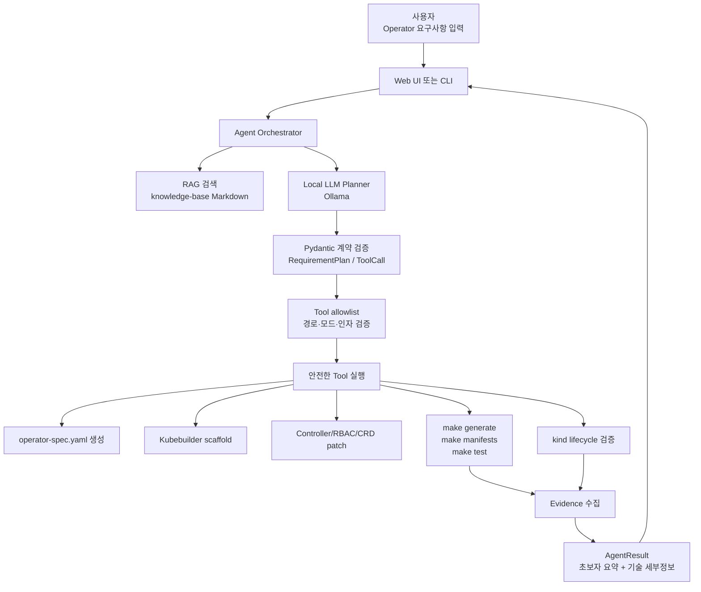
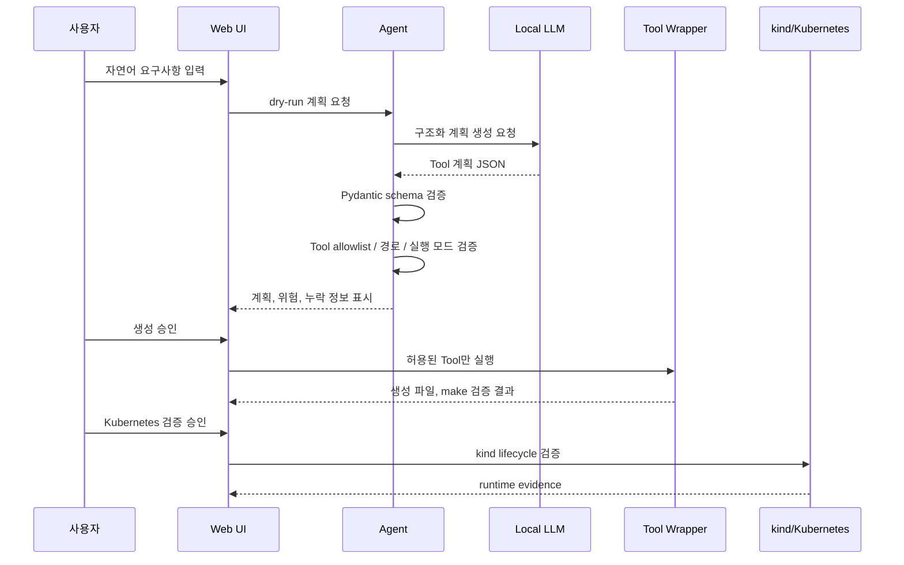
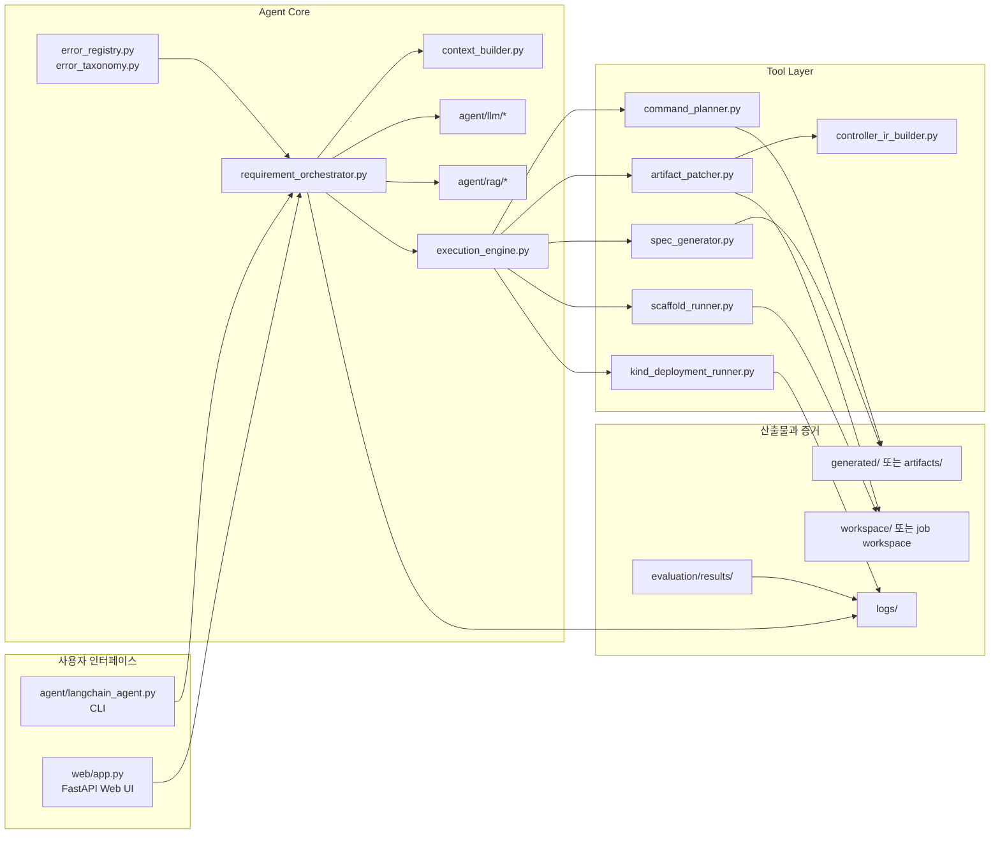

# Kubebuilder Operator AI Agent

자연어 요구사항을 입력하면 Kubernetes Operator 개발에 필요한 구조화 스펙, Kubebuilder 프로젝트, Controller 코드, RBAC, 검증 로그와 실행 근거를 생성하는 로컬 실행형 AI 개발지원 시스템입니다.

이 프로젝트는 LLM 답변을 그대로 복사해 쓰는 챗봇이 아니라, AI 계획을 Pydantic 계약과 Tool allowlist로 검증한 뒤 제한된 자동화 도구만 실행하는 생성·검증 중심 Agent입니다.

## 과제 요약

| 항목 | 내용 |
| --- | --- |
| 과제명 | Kubebuilder 기반 Operator 개발 자동화를 위한 AI 기반 생성·검증 시스템 |
| 과제 유형 | AI 기반 개발/운영업무 생산성 향상 |
| 대상 사용자 | Kubernetes Operator를 처음 만들거나 반복적으로 작성해야 하는 플랫폼/서비스 개발자 |
| 해결 문제 | 자연어 요구사항을 CRD, Controller, RBAC, 검증 가능한 Operator 프로젝트로 바꾸는 과정이 어렵고 수작업 오류가 많음 |
| 핵심 접근 | Local LLM + RAG + 구조화 계약 + 안전한 Tool 실행 + kind lifecycle evidence |
| 현재 수준 | 로컬/내부 사용 가능한 제품형 MVP |

## 해결하려는 Pain Point

Kubernetes Operator 개발은 다음 지식과 절차가 동시에 필요합니다.

- CRD API group/version/kind 설계
- spec/status 필드 타입 정의
- Kubebuilder scaffold와 code generation
- Controller reconcile 로직 작성
- RBAC 최소 권한 작성
- `make generate`, `make manifests`, `make test` 검증
- kind 클러스터에서 create/update/drift/delete lifecycle 확인
- 실패 로그를 보고 원인과 복구 방향 판단

초보 개발자에게는 이 과정이 길고, 중간에 실패하면 어디를 고쳐야 하는지 알기 어렵습니다. 이 Agent는 사용자가 자연어로 원하는 Operator를 설명하면 안전한 계획을 먼저 보여주고, 승인 후 코드 생성과 검증을 자동화합니다.

## 전체 동작 흐름


```mermaid
flowchart TD
    U["사용자<br/>Operator 요구사항 입력"] --> W["Web UI 또는 CLI"]
    W --> A["Agent Orchestrator"]
    A --> R["RAG 검색<br/>knowledge-base Markdown"]
    A --> L["Local LLM Planner<br/>Ollama"]
    L --> C["Pydantic 계약 검증<br/>RequirementPlan / ToolCall"]
    C --> V["Tool allowlist<br/>경로·모드·인자 검증"]
    V --> T["안전한 Tool 실행"]
    T --> S["operator-spec.yaml 생성"]
    T --> P["Kubebuilder scaffold"]
    T --> G["Controller/RBAC/CRD patch"]
    T --> M["make generate<br/>make manifests<br/>make test"]
    T --> K["kind lifecycle 검증"]
    M --> E["Evidence 수집"]
    K --> E
    E --> O["AgentResult<br/>초보자 요약 + 기술 세부정보"]
    O --> W
```

## 안전 실행 구조


```mermaid
sequenceDiagram
    participant User as 사용자
    participant UI as Web UI
    participant Agent as Agent
    participant LLM as Local LLM
    participant Tools as Tool Wrapper
    participant K8s as kind/Kubernetes

    User->>UI: 자연어 요구사항 입력
    UI->>Agent: dry-run 계획 요청
    Agent->>LLM: 구조화 계획 생성 요청
    LLM-->>Agent: Tool 계획 JSON
    Agent->>Agent: Pydantic schema 검증
    Agent->>Agent: Tool allowlist / 경로 / 실행 모드 검증
    Agent-->>UI: 계획, 위험, 누락 정보 표시
    User->>UI: 생성 승인
    UI->>Tools: 허용된 Tool만 실행
    Tools-->>UI: 생성 파일, make 검증 결과
    User->>UI: Kubernetes 검증 승인
    UI->>K8s: kind lifecycle 검증
    K8s-->>UI: runtime evidence
```

핵심 원칙은 다음과 같습니다.

- LLM은 셸 명령을 직접 실행하지 않습니다.
- 기본 실행은 dry-run입니다.
- 실제 파일 생성과 kind 검증은 사용자 승인 이후에만 수행됩니다.
- Tool 이름, 인자, 경로, 실행 모드는 코드에서 검증합니다.
- 실패 복구는 자동 실행하지 않고, 근거 기반 계획만 제안합니다.
- Docker/kind 같은 인프라 실패는 Operator 코드 실패와 분리합니다.

## 필수 실행 환경

| 구분 | 필요 환경 | 비고 |
| --- | --- | --- |
| OS | Linux 또는 WSL2 Ubuntu | 개발 기준은 WSL2 Ubuntu 24.04 |
| Python | Python 3.10 이상 | FastAPI Web UI와 Agent 실행 |
| Go | Go 1.22 이상 권장 | Kubebuilder 프로젝트 생성/테스트 |
| Docker | Docker Desktop + WSL integration | kind 검증에 필요 |
| Kubernetes 도구 | kubectl, kind, kubebuilder, kustomize | `scripts/install-local-tools.sh`로 로컬 설치 가능 |
| Local LLM | Ollama | 기본 모델: `qwen2.5-coder:3b` |
| Python 패키지 | `requirements.txt` | FastAPI, LangChain, Pydantic, FAISS 등 |

Docker Desktop을 WSL에서 사용할 경우 다음이 성공해야 합니다.

```bash
docker info
```

Docker가 꺼져 있거나 WSL integration이 끊긴 경우 kind 검증은 `DOCKER_DAEMON_UNAVAILABLE`로 빠르게 실패하며, lifecycle evidence로 기록하지 않습니다.

## 설치

```bash
python3 -m venv .venv
source .venv/bin/activate
pip install -r requirements.txt
```

로컬 Kubernetes 개발 도구를 설치합니다.

```bash
./scripts/install-local-tools.sh
export PATH="$PWD/.tools/bin:$PATH"
./scripts/check-env.sh
```

Ollama 모델을 준비합니다.

```bash
ollama pull qwen2.5-coder:3b
```

## Web UI 실행

```bash
uvicorn web.app:app --host 0.0.0.0 --port 8000
```

브라우저에서 접속합니다.

```text
http://localhost:8000
```

Web UI 기본 흐름은 다음과 같습니다.

1. 만들고 싶은 Operator 요구사항을 자연어로 작성합니다.
2. Agent가 계획과 누락 정보를 먼저 보여줍니다.
3. 사용자가 승인하면 Kubebuilder 프로젝트와 코드를 생성합니다.
4. 생성 후 `make generate`, `make manifests`, `make test`를 실행합니다.
5. 사용자가 원하면 kind 클러스터에서 lifecycle을 검증합니다.
6. 결과 화면에서 초보자 요약, 생성 파일, kubectl 확인 명령, 실패 원인을 확인합니다.

## CLI 실행 예시

계획만 생성합니다.

```bash
python3 agent/langchain_agent.py \
  --requirement requirements/web-service.txt \
  --mode dry-run \
  --run-level fast
```

실제 Kubebuilder 프로젝트와 파일을 생성합니다.

```bash
python3 agent/langchain_agent.py \
  --requirement requirements/web-service.txt \
  --mode execute \
  --execute \
  --run-level fast
```

profile 없이 여러 Operator 요구사항을 컴파일 검증합니다.

```bash
python3 agent/evaluation/profileless_compile_runner.py \
  --output-dir evaluation/results/profileless-compile/local \
  --jobs 2
```

Docker/kind가 준비된 경우 실제 lifecycle을 검증합니다.

```bash
python3 agent/evaluation/profileless_kind_runner.py \
  --output-dir evaluation/results/profileless-kind/local
```

## 요구사항 작성에 필요한 정보

초보자도 아래 네 가지만 쓰면 Agent가 안정적으로 계획을 세울 수 있습니다.

| 정보 | 필요한 이유 | 예시 |
| --- | --- | --- |
| 리소스 이름과 API | Kubernetes가 CRD를 식별하는 주소 | `kind: WebApp`, `api: apps.sample.io/v1alpha1` |
| 입력값과 타입 | CRD spec 필드와 Go 타입 생성 | `image: string`, `replicas: int32` |
| 관리 대상과 동작 | Controller reconcile 코드 생성 | `Deployment를 생성하고 replicas 변경을 반영` |
| status와 삭제 방식 | 사용자가 kubectl로 상태를 확인하고 lifecycle을 이해 | `readyReplicas`, `삭제 시 Deployment도 삭제` |

예시:

```text
CustomerPortal Operator를 만들어 주세요.
API는 apps.sample.io/v1alpha1입니다.

spec:
- image: string
- replicas: int32

status:
- phase: string
- readyReplicas: int32
- message: string

Controller는 Deployment를 생성하고, image와 replicas 변경을 반영해야 합니다.
외부에서 Deployment가 변경되면 spec 기준으로 복구해야 합니다.
CustomerPortal이 삭제되면 Deployment도 함께 삭제해야 합니다.
```

## Capability 등급

Capability 등급은 새 Custom Resource 이름이 아니라, 관리하려는 Kubernetes 리소스와 lifecycle 패턴의 검증 증거를 기준으로 판단합니다.

| 등급 | 의미 |
| --- | --- |
| stable | compile, kind lifecycle, drift 복구, RBAC, 삭제 정책 등 runtime evidence가 충분함 |
| beta | 일부 runtime evidence가 있으나 조합/edge case 검증이 제한적임 |
| experimental | catalog/schema 또는 compile 증거는 있으나 kind lifecycle evidence가 부족함 |

예를 들어 처음 보는 `CustomerPortal` CR이라도 내부에서 검증된 Deployment lifecycle을 사용하면 stable로 볼 수 있습니다. 반대로 `NetworkPolicy`처럼 아직 kind lifecycle 증거가 부족한 리소스 패턴은 experimental로 표시합니다.

## 검증과 성과 지표

이 프로젝트는 기능 구현뿐 아니라 회귀 검증과 runtime evidence를 함께 관리합니다.

```bash
# LLM과 Docker 없이 빠르게 수행하는 기본 회귀
python3 scripts/run-regression-tests.py \
  --suite quick \
  --output-dir evaluation/results/regression/local-quick

# Local LLM 일관성까지 포함
python3 scripts/run-regression-tests.py \
  --suite standard \
  --output-dir evaluation/results/regression/local-standard

# Docker/kind lifecycle까지 포함
python3 scripts/run-regression-tests.py \
  --suite full \
  --output-dir evaluation/results/regression/local-full
```

주요 검증 항목:

- 자연어 요구사항 파싱 일관성
- 부정/제외 표현 처리
- 필수 정보 누락 시 clarification-required 처리
- Tool allowlist와 경로 제한
- 구조화 errorCode 분류
- RAG 검색 품질
- profileless Operator compile matrix
- kind lifecycle matrix
- RBAC 최소 권한
- drift recovery
- read-only watch
- retain/delete/finalizer 정책
- Docker unavailable fail-fast

최근 검증 예시:

| 항목 | 결과 |
| --- | --- |
| Quick regression | 통과 |
| Response consistency | 29/29 통과 |
| Docker unavailable 테스트 | 약 8초 내 `DOCKER_DAEMON_UNAVAILABLE` 분류 |
| Docker unavailable lifecycle evidence | 전부 `not-run`, 성공 evidence 미기록 |

## 시스템 구조


```mermaid
flowchart LR
    subgraph UI["사용자 인터페이스"]
        WEB["web/app.py<br/>FastAPI Web UI"]
        CLI["agent/langchain_agent.py<br/>CLI"]
    end

    subgraph AGENT["Agent Core"]
        ORCH["requirement_orchestrator.py"]
        CTX["context_builder.py"]
        LLM["agent/llm/*"]
        RAG["agent/rag/*"]
        EXEC["execution_engine.py"]
        ERR["error_registry.py<br/>error_taxonomy.py"]
    end

    subgraph TOOLS["Tool Layer"]
        SPEC["spec_generator.py"]
        PLAN["command_planner.py"]
        SCAF["scaffold_runner.py"]
        PATCH["artifact_patcher.py"]
        IR["controller_ir_builder.py"]
        KIND["kind_deployment_runner.py"]
    end

    subgraph OUTPUT["산출물과 증거"]
        ART["generated/ 또는 artifacts/"]
        WORK["workspace/ 또는 job workspace"]
        LOG["logs/"]
        EVAL["evaluation/results/"]
    end

    WEB --> ORCH
    CLI --> ORCH
    ORCH --> CTX
    ORCH --> LLM
    ORCH --> RAG
    ORCH --> EXEC
    EXEC --> SPEC
    EXEC --> PLAN
    EXEC --> SCAF
    EXEC --> PATCH
    PATCH --> IR
    EXEC --> KIND
    SPEC --> ART
    PLAN --> ART
    SCAF --> WORK
    PATCH --> WORK
    KIND --> LOG
    ORCH --> LOG
    ERR --> ORCH
    EVAL --> LOG
```

## 소스코드 설명

| 경로 | 역할 |
| --- | --- |
| `web/app.py` | FastAPI Web UI 진입점. 요구사항 입력, 작업 상태, 결과 화면, kind 검증 요청을 처리 |
| `web/workflow_service.py` | Web 요청을 Agent CLI 명령으로 변환하고 작업 큐에 등록 |
| `web/job_manager.py` | 비동기 작업 상태, 로그, 재시도/중단 상태 관리 |
| `web/result_presenter.py` | Agent/Tool 결과 JSON을 초보자용 화면 데이터로 변환 |
| `agent/langchain_agent.py` | CLI 진입점. 요구사항 실행과 로그 분석 실행을 분기 |
| `agent/requirement_orchestrator.py` | 요구사항 분석, LLM 계획, Tool 실행, 최종 평가, recovery planning의 중심 흐름 |
| `agent/context_builder.py` | 자연어 requirement에서 API, spec/status, 관리 리소스, 누락 정보를 정규화 |
| `agent/contracts.py` | RequirementPlan, ToolCall, ToolResult, FinalEvaluation 등 Pydantic 계약 |
| `agent/execution_engine.py` | 검증된 Tool call만 순서대로 실행하고 첫 실패에서 중단 |
| `agent/error_registry.py` | errorCode, 사용자 메시지, recovery 정책, retry 가능 여부, UI severity의 중앙 registry |
| `agent/error_taxonomy.py` | Tool stdout/stderr와 structured error를 표준 errorCode로 변환 |
| `agent/recovery_orchestrator.py` | 실패 context와 RAG 근거를 바탕으로 복구 계획을 생성 |
| `agent/recovery_policy.py` | 복구 계획의 allowlist, 근거, 자동 실행 금지 정책 검증 |
| `agent/llm/*` | Ollama 호환 Local LLM client, planner, prompt 구성 |
| `agent/rag/*` | Markdown knowledge-base 로딩, 검색, reranking |
| `agent/tools/spec_generator.py` | 자연어 요구사항을 `operator-spec.yaml` 계약으로 변환 |
| `agent/tools/capability_drafter.py` | catalog에 없는 capability 초안을 생성하고 승인 계약을 만듦 |
| `agent/tools/scaffold_runner.py` | Kubebuilder init/create api 실행 또는 dry-run |
| `agent/tools/artifact_patcher.py` | API 타입, sample YAML, RBAC marker, Controller 코드를 보정 |
| `agent/tools/controller_ir.py` | Controller 생성을 위한 중간 표현(IR) Pydantic 모델 |
| `agent/tools/controller_ir_builder.py` | operator spec과 capability catalog를 Controller IR로 변환 |
| `agent/tools/controller_emitters.py` | IR 기반으로 Go reconcile 코드 조각 생성 |
| `agent/tools/kind_deployment_runner.py` | kind 클러스터 생성, 이미지 빌드/로드, Controller 배포, lifecycle 검증 |
| `agent/tools/kind_deployment_validators.py` | managed resource, read-only, retain/delete, finalizer 등 runtime 검증기 |
| `evaluation/` | RAG 품질, response consistency, profileless compile/kind, unified evaluation runner |
| `config/resource-capabilities.yaml` | Kubernetes 리소스 capability catalog |
| `config/capability-support.yaml` | UI에 표시하는 stable/beta/experimental evidence |
| `knowledge-base/` | RAG가 참조하는 Kubebuilder guide, troubleshooting, example 문서 |
| `docs/` | 상세 설계, 품질 기준, 요구사항 작성 가이드, 데모 시나리오 |

## 주요 산출물

| 산출물 | 위치 |
| --- | --- |
| Agent 실행 로그 | `logs/agent/<timestamp>/` |
| Web 작업 로그 | `logs/web/jobs/<job-id>/` |
| Operator spec | `generated/*-operator-spec.yaml` 또는 Web job artifacts |
| Command plan | `generated/*-command-plan.md` 또는 Web job artifacts |
| Kubebuilder workspace | `workspace/` 또는 Web job workspace |
| kind 검증 결과 | `profileless-kind-results.json` |
| 회귀 검증 결과 | `evaluation/results/` |

## 제한사항

- 100% 범용 자연어 이해 시스템은 아닙니다. 필수 API 정보, 필드 타입, 관리 리소스가 부족하면 추가 정보를 요청합니다.
- Docker/kind 검증은 로컬 Docker Desktop과 WSL integration 상태에 영향을 받습니다.
- `experimental` capability는 생성은 가능할 수 있으나 실제 kind lifecycle 증거가 부족하므로 코드와 RBAC 검토가 필요합니다.
- LLM planning은 local cache와 schema repair로 안정화했지만, 최종 판단은 Tool 결과와 구조화 evidence를 우선합니다.
- 복구 계획은 자동 실행하지 않습니다. 사용자가 검토하고 승인해야 합니다.

## 보고서 작성 시 강조할 점

심사 기준에 맞춰 다음 내용을 중심으로 설명할 수 있습니다.

- 문제 정의: Operator 개발 과정의 복잡도, 반복 작업, 실패 원인 파악 어려움
- 기술 선택 타당성: Local LLM, RAG, Pydantic 계약, 안전한 Tool wrapper, kind evidence 조합
- 구현 완성도: Web UI, CLI, 코드 생성, make 검증, runtime 검증, error taxonomy, recovery planning
- 정량 지표: 회귀 테스트 통과율, response consistency, fail-fast 시간, 수동 단계 감소
- 정성 지표: 초보자용 설명, kubectl 확인 명령, capability 신뢰도 표시, 실패 원인 구분

## 참고 문서

- [시각적 전체 흐름](docs/visual-overview.md)
- [요구사항 작성 가이드](docs/requirement-writing-guide.md)
- [품질 기준](docs/quality-thresholds.md)
- [안전성과 증거 설계](docs/agent-evidence-and-safety.md)
- [현재 MVP 상태](docs/current-mvp-status.md)
- [문제 해결 가이드](docs/troubleshooting-guide.md)
