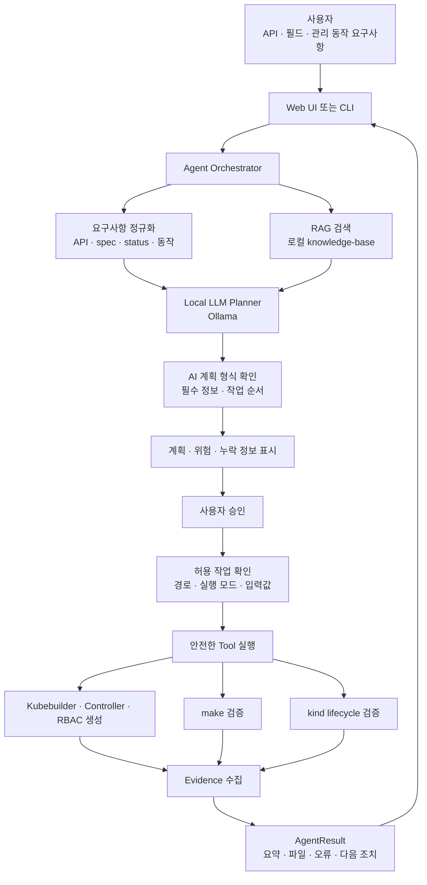

# k8sagent

### Operator의 API·필드·관리 동작을 정리해 Kubernetes 프로젝트를 생성하고 검증하는 AI Agent

[필요한 이유](#k8sagent가-필요한-이유) · [동작 방식](#동작-방식) · [AI 모델](#local-llm-선택과-역할) · [빠른 시작](#빠른-시작) · [입력 예시](#입력-예시) · [검증](#검증) · [저장소 구조](#저장소-구조)

k8sagent는 사용자가 작성한 Custom Resource 이름과 API, spec/status 필드, 관리 동작을 바탕으로 Kubebuilder 프로젝트, Controller, CRD, RBAC을 생성합니다. 생성 전에는 이해한 내용과 작업 계획을 보여주고, 승인 후에는 빌드·테스트와 선택적인 kind lifecycle 검증을 수행합니다.

AI가 만든 답변이나 명령을 그대로 실행하지 않습니다. 필요한 정보와 작업 순서가 올바른 형식인지 먼저 확인하고, 시스템에 미리 등록된 안전한 작업만 실행합니다. 최종 성공 여부는 설명이 아니라 실제 빌드·테스트와 Kubernetes 검증 결과로 판단합니다.

## k8sagent가 필요한 이유

Kubernetes Operator를 만들려면 CRD 설계, Go 타입, Reconcile 로직, RBAC, 코드 생성, 테스트와 실제 클러스터 검증을 함께 다뤄야 합니다. 
처음 만드는 개발자는 요구사항을 코드 구조로 바꾸는 과정과 실패 원인을 찾는 과정에서 많은 시간을 사용합니다.

k8sagent의 대상 사용자는 Operator를 처음 만들거나 비슷한 Controller를 반복해서 작성하는 플랫폼·서비스 개발자입니다.

### Kubebuilder란?

Kubebuilder는 Kubernetes Custom Resource와 이를 관리하는 Controller를 Go로 개발할 때 사용하는 프로젝트 생성 도구입니다. `kubebuilder init`과 `kubebuilder create api` 명령으로 API 타입, Controller, CRD, RBAC, 테스트에 필요한 기본 디렉터리와 파일을 만듭니다.

Kubebuilder가 프로젝트의 기본 골격을 제공한다면, k8sagent는 사용자의 API·필드·관리 동작 요구사항을 그 골격에 연결합니다. Controller의 Reconcile 동작과 최소 RBAC을 생성하고, `make` 검증과 kind lifecycle 확인까지 이어주는 역할을 합니다.

| 일반적인 개발 흐름 | k8sagent가 제공하는 흐름 |
| --- | --- |
| 요구사항을 API와 Go 타입으로 직접 변환 | API·필드·관리 동작 설명을 구조화된 Operator 스펙으로 변환 |
| Kubebuilder 명령과 프로젝트 구조를 직접 구성 | 검증된 Tool로 프로젝트와 API 골격 생성 |
| Controller와 RBAC을 반복 작성 | 동작 중심 IR을 이용해 Controller와 최소 권한 생성 |
| 빌드와 테스트를 수동으로 반복 | `make generate`, `make manifests`, `make test` 자동 검증 |
| Kubernetes lifecycle을 수작업으로 확인 | kind에서 생성·수정·drift 복구·삭제 정책 검증 |
| 긴 로그에서 원인을 직접 추측 | 구조화 오류 코드와 근거 기반 다음 조치 제공 |

## 동작 방식


```mermaid
flowchart TD
    U["사용자<br/>API · 필드 · 관리 동작 요구사항"] --> W["Web UI 또는 CLI"]
    W --> O["Agent Orchestrator"]
    O --> N["요구사항 정규화<br/>API · spec · status · 동작"]
    O --> R["RAG 검색<br/>로컬 knowledge-base"]
    N --> L["Local LLM Planner<br/>Ollama"]
    R --> L
    L --> C["AI 계획 형식 확인<br/>필수 정보 · 작업 순서"]
    C --> P["계획 · 위험 · 누락 정보 표시"]
    P --> A["사용자 승인"]
    A --> V["허용 작업 확인<br/>경로 · 실행 모드 · 입력값"]
    V --> T["안전한 Tool 실행"]
    T --> G["Kubebuilder · Controller · RBAC 생성"]
    T --> M["make 검증"]
    T --> K["kind lifecycle 검증"]
    G --> E["Evidence 수집"]
    M --> E
    K --> E
    E --> X["AgentResult<br/>요약 · 파일 · 오류 · 다음 조치"]
    X --> W
```

### 설계 원칙

| 원칙 | 적용 방식 |
| --- | --- |
| AI와 실행 책임 분리 | LLM은 요구사항 해석과 계획을 담당하고 셸 명령을 직접 실행하지 않음 |
| AI 출력 형식 확인 | 리소스, 필드와 작업 목록이 정해진 형식을 갖췄는지 Pydantic으로 검사 |
| 결정론적 코드 생성 | `operator_spec → controller_ir → generated_code` 단방향 경계 사용 |
| 명시적 승인 | 기본은 dry-run이며 파일 생성과 kind 검증은 사용자 승인 후 실행 |
| 허용된 작업만 실행 | 미리 등록된 작업(Tool allowlist), 경로, 입력값과 검증 명령만 실행 |
| 실행 근거 우선 | LLM 설명보다 make 결과와 kind lifecycle evidence를 우선 |
| 안전한 실패 | 필수 정보가 없거나 모순되면 Tool을 실행하지 않고 필요한 질문을 반환 |
| 근거 기반 복구 | 실제 오류 코드와 로그가 있을 때만 복구 계획을 제안하며 자동 실행하지 않음 |

## Local LLM 선택과 역할

기본 모델은 Ollama에서 실행하는 `qwen2.5-coder:3b`입니다. Kubernetes와 Go 개발 용어, JSON 형태의 작업 계획을 다루는 데 적합한 코드 특화 모델이면서, 7B급 모델보다 로컬 CPU·메모리 부담을 낮출 수 있는 중간 크기라는 점을 고려했습니다.
요구사항과 생성 로그를 외부 API로 보내지 않고 로컬에서 처리할 수 있다는 점도 선택 이유입니다.

| 사용 단계 | 모델의 역할 |
| --- | --- |
| 요구사항 계획 | 정규화된 요구사항과 RAG 검색 결과를 바탕으로 누락 정보, 위험 요소와 Tool 실행 순서를 구성 |
| 결과 평가 | `run-level standard/full`에서 실제 Tool 결과를 읽고 성공 여부와 사용자 설명을 정리 |
| 실패 분석과 복구 계획 | 구조화된 오류 규칙만으로 원인을 확정할 수 없을 때 실제 로그와 검색 근거를 바탕으로 다음 조치를 제안 |
| 선택적 RAG 재정렬 | 여러 검색 문서 중 요구사항이나 오류와 관련성이 높은 문서를 우선 배치 |

모델은 Go Controller 코드나 셸 명령을 직접 생성·실행하지 않습니다. 실제 코드는 검증된 `operator_spec → controller_ir → generated_code` 흐름으로 생성하며, 모델 출력은 JSON 형식과 필수 항목을 검사한 뒤 계획으로만 사용합니다.
결과 편차를 줄이기 위해 기본 temperature는 `0`이며, 모델은 환경변수 `LOCAL_LLM_MODEL`로 교체할 수 있습니다.

## 현재 검증된 관리 패턴과 확장 방식

k8sagent는 특정 Custom Resource 이름이나 준비된 예시에 종속된 생성기가 아닙니다. 리소스 생성·갱신, 읽기 전용 관찰, 외부 drift 복구, status 반영, 소유권과 삭제 정책 같은 Controller 동작을 조합해 코드를 생성합니다.

아래 목록은 생성 가능한 전체 범위가 아니라, 현재 compile과 kind lifecycle 검증 근거가 확보된 Kubernetes 관리 패턴을 보여줍니다. 
지원 수준은 새 Custom Resource 이름이 아니라 관리 리소스와 동작 조합의 검증 결과로 결정합니다.

| 수준 | 현재 리소스 |
| --- | --- |
| 검증 충분 `stable` | ConfigMap, Secret, CronJob, Deployment, StatefulSet, Service, Namespace, DaemonSet, Job |
| 일부 검증 `beta` | PersistentVolumeClaim, ServiceAccount, Role, ClusterRole |
| 검증 근거 부족 `experimental` | NetworkPolicy, HorizontalPodAutoscaler, Pod |

처음 보는 Custom Resource 이름이라도 이미 검증된 Deployment 관리 패턴을 사용하면 동일한 근거를 적용할 수 있습니다. 새로운 Kubernetes 리소스는 capability catalog와 Controller IR을 통해 추가할 수 있으며, 검증이 부족한 패턴은 다른 리소스로 임의 대체하지 않고 `experimental` 또는 미지원 상태로 구분합니다.

등급은 생성된 Operator가 운영 환경에 즉시 배포 가능하다는 뜻이 아닙니다. 
k8sagent가 해당 관리 패턴에 대해 확보한 compile·kind·drift·RBAC·삭제 검증 수준을 의미합니다. 최신 계약과 제한사항은 [config/capability-support.yaml](config/capability-support.yaml)에서 확인할 수 있습니다.

## 필수 환경

| 구분 | 환경 | 용도 |
| --- | --- | --- |
| OS | Linux 또는 WSL2 Ubuntu | 로컬 실행 환경 |
| Python | 3.12 권장, 3.10 이상 | Agent와 FastAPI Web UI |
| Go | 설치 스크립트의 고정 버전 사용 가능 | Kubebuilder 프로젝트 생성과 테스트 |
| Local LLM | Ollama, 기본 `qwen2.5-coder:3b` | 요구사항 계획과 결과 분석 |
| Docker | Docker Engine 또는 Docker Desktop | kind 검증을 실행할 때 필요 |
| Kubernetes 도구 | kubectl, kind, kubebuilder, kustomize | scaffold와 로컬 클러스터 검증 |

`scripts/install-local-tools.sh`는 Go, kind, kubebuilder, kustomize를 저장소의 `.tools/`에 설치합니다. 
Docker와 kubectl은 운영체제에 맞게 별도로 준비해야 합니다.

WSL2에서 Docker Desktop을 사용할 때는 WSL integration을 활성화하고 다음 명령이 성공해야 합니다.

```bash
docker info
```

Docker에 연결할 수 없으면 kind 단계는 `DOCKER_DAEMON_UNAVAILABLE`로 중단되며, 실행되지 않은 lifecycle 항목은 성공 근거로 기록하지 않습니다.

## 빠른 시작

### 1. 환경 준비

```bash
python3 -m venv .venv
source .venv/bin/activate
pip install -r requirements.txt

./scripts/install-local-tools.sh
export PATH="$PWD/.tools/bin:$PATH"
./scripts/check-env.sh
```

### 2. Local LLM

```bash
ollama pull qwen2.5-coder:3b
```

필요하면 endpoint와 모델을 환경변수로 변경할 수 있습니다.

```bash
export LOCAL_LLM_BASE_URL=http://localhost:11434/v1
export LOCAL_LLM_MODEL=qwen2.5-coder:3b
```

### 3. Web UI

```bash
uvicorn web.app:app --host 0.0.0.0 --port 8000
```

브라우저에서 [http://localhost:8000](http://localhost:8000)에 접속합니다.

Web UI에서는 다음 순서로 진행합니다.

1. Custom Resource 이름과 API, 필드, 관리 동작을 문장으로 설명합니다.
2. Agent가 정리한 API, 필드, 관리 리소스, 권한과 제한사항을 확인합니다.
3. 계획을 승인하면 Kubebuilder 프로젝트와 코드를 생성하고 make 검증을 수행합니다.
4. Docker가 준비된 경우 kind lifecycle 검증을 실행합니다.
5. 결과 화면에서 생성 파일, 검증 근거, kubectl 확인 명령과 실패 원인을 확인합니다.

## 입력 예시

안정적인 계획을 위해 다음 네 가지 정보를 작성하는 것을 권장합니다.

| 정보 | 예시 |
| --- | --- |
| Custom Resource 이름과 API | `CustomerPortal`, `apps.sample.io/v1alpha1` |
| spec 입력값과 타입 | `image: string`, `replicas: int32` |
| 관리 대상과 동작 | Deployment 생성, 변경 반영, 외부 drift 복구 |
| status와 삭제 방식 | `readyReplicas`, CR 삭제 시 Deployment 함께 삭제 |

```text
CustomerPortal Operator를 만들어 주세요.
API는 apps.sample.io/v1alpha1입니다.

spec:
- image: string
- replicas: int32

status:
- phase: string
- readyReplicas: int32
- message: string

Controller는 Deployment를 생성하고 image와 replicas 변경을 반영해야 합니다.
외부에서 Deployment가 변경되면 spec 기준으로 복구해야 합니다.
CustomerPortal이 삭제되면 Deployment도 함께 삭제해야 합니다.
```

정보가 없거나 서로 모순되면 임의 값을 만들어 실행하지 않고, 보완할 항목을 질문합니다.

## CLI

계획만 확인합니다.

```bash
python3 agent/langchain_agent.py \
  --requirement requirements/web-service.txt \
  --mode dry-run \
  --run-level fast
```

계획된 파일 생성과 make 검증을 실행합니다.

```bash
python3 agent/langchain_agent.py \
  --requirement requirements/web-service.txt \
  --mode execute \
  --execute \
  --run-level fast
```

## 검증

회귀 검증은 실행 환경에 따라 세 단계로 나뉩니다.

| Suite | 포함 범위 | 필요한 환경 |
| --- | --- | --- |
| `quick` | Unit, RAG 품질, 요구사항 의미 일관성, 안전 정책 | Python |
| `standard` | Quick + 실제 Local LLM Agent 실행 | Python, Ollama |
| `full` | Standard + scaffold compile + Docker/kind lifecycle | Python, Ollama, Go, Docker, Kubernetes 도구 |

```bash
# 빠른 회귀
python3 scripts/run-regression-tests.py \
  --suite quick \
  --output-dir evaluation/results/regression/local-quick

# Local LLM 포함
python3 scripts/run-regression-tests.py \
  --suite standard \
  --output-dir evaluation/results/regression/local-standard

# Docker와 kind 포함
python3 scripts/run-regression-tests.py \
  --suite full \
  --output-dir evaluation/results/regression/local-full
```

2026-07-14 로컬 Quick 기준:

- Unit test: 306개 통과, 조건부 제외 1개, 실패 0개
- 요구사항 의미 일관성: 29/29 시나리오 통과
- RAG 검색 품질 기준 통과
- Tool 실행 안전성과 오류 처리 정책 통과

Quick은 실제 Local LLM 호출과 Docker/kind 실행을 제외한 핵심 코드 회귀 검사입니다.

### GitHub Actions 자동 검증

검증 비용과 필요한 실행 환경에 따라 자동화 범위를 나눕니다.

| 실행 시점 | Workflow | 목적 |
| --- | --- | --- |
| Pull Request 생성·변경 | [quick.yml](.github/workflows/quick.yml) | 병합 전에 빠른 회귀 검사 수행 |
| `main` 반영 및 주간 정기 실행 | [standard.yml](.github/workflows/standard.yml) | Local LLM을 포함한 실제 Agent 흐름 확인 |
| Docker/kind 통합 확인이 필요할 때 수동 실행 | [full.yml](.github/workflows/full.yml) | compile과 Kubernetes lifecycle 전체 검증 |

검증 결과는 `evaluation/results/`에 생성되며 Git에는 누적하지 않습니다.

## 저장소 구조

| 경로 | 역할 |
| --- | --- |
| `web/` | FastAPI UI, 비동기 작업, 진행 상태와 결과 표현 |
| `agent/` | 요구사항 분석, 계획, 계약 검증, 실행, 결과와 복구 흐름 |
| `agent/llm/` | Ollama 호환 Local LLM client와 planner |
| `agent/rag/` | Markdown 로딩, keyword/vector 검색과 reranking |
| `agent/tools/` | 스펙, scaffold, IR, Controller, RBAC, kind 검증 Tool |
| `config/` | 리소스 capability, 검증 수준, legacy 정책 |
| `knowledge-base/` | RAG가 검색하는 Kubebuilder와 오류 대응 문서 |
| `requirements/` | 회귀 검증에 사용하는 자연어 요구사항 fixture |
| `evaluation/` | RAG, 일관성, compile, kind와 통합 결과 검증 |
| `scripts/` | 환경 설치·확인 및 회귀 실행 진입점 |
| `docs/` | 상세 아키텍처, 계약, 품질과 사용 가이드 |

주요 실행 진입점:

- `web/app.py`: Web UI
- `agent/langchain_agent.py`: Agent CLI
- `agent/requirement_orchestrator.py`: 계획부터 최종 결과까지의 중심 흐름
- `agent/execution_engine.py`: 검증된 Tool 순차 실행
- `agent/tools/controller_ir_builder.py`: Operator 스펙을 Controller IR로 변환
- `agent/tools/controller_emitters.py`: IR에서 Go Controller 코드 생성
- `agent/tools/kind_deployment_runner.py`: kind 배포와 lifecycle evidence 수집

## 실행 산출물

| 산출물 | 위치 |
| --- | --- |
| Agent 로그 | `logs/agent/<timestamp>/` |
| Web 작업 | `logs/web/jobs/<job-id>/` |
| Operator 스펙과 계획 | `generated/` 또는 Web job의 `artifacts/` |
| Kubebuilder 프로젝트 | `workspace/` 또는 Web job의 `workspace/` |
| 회귀 결과 | `evaluation/results/` |

로그와 생성 산출물은 기본적으로 `.gitignore` 대상입니다.

## 제한사항

- 모든 자연어 표현과 Kubernetes API를 자동 지원하지는 않습니다.
- API 정보, 필드 타입, 관리 대상이나 삭제 정책이 불명확하면 추가 정보를 요청합니다.
- `experimental` 패턴은 실제 kind 근거가 부족하므로 생성 코드와 RBAC을 검토해야 합니다.
- Docker와 kind 결과는 로컬 컨테이너 환경과 네트워크 상태의 영향을 받습니다.
- LLM planning은 cache와 1회 schema repair를 사용하지만, 최종 판정은 Tool 결과를 우선합니다.
- 복구 계획은 자동으로 실행하지 않습니다.

## 상세 문서

### 시작과 운영

- [시각적 전체 흐름](docs/visual-overview.md)
- [요구사항 작성 가이드](docs/requirement-writing-guide.md)
- [제품 검증 체크리스트](docs/product-validation-checklist.md)
- [문제 해결 가이드](docs/troubleshooting-guide.md)

### 구조와 계약

- [AI Agent 아키텍처](docs/ai-agent-architecture.md)
- [Operator 스펙 계약](docs/spec-schema.md)
- [안전성과 실행 근거](docs/agent-evidence-and-safety.md)
- [Local LLM 사용 정책](docs/local-model-usage-policy.md)
- [RAG 평가 구조](docs/rag-evaluation.md)

### 품질과 현재 범위

- [평가 지표](docs/evaluation-metrics.md)
- [품질 기준](docs/quality-thresholds.md)
- [현재 시스템 상태](docs/current-system-status.md)
- [Legacy 경로 정책](docs/legacy-path-policy.md)
