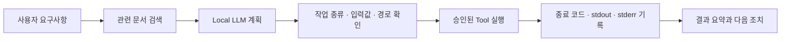

# 실행 기록과 안전장치

## 이 문서에서 확인할 수 있는 것

k8sagent는 Local LLM의 설명만으로 작업 성공을 판단하지 않습니다. 계획, 허용된 작업, 실제 명령 결과와 실패 원인을 파일로 남겨 다음 질문에 답할 수 있게 합니다.

- Agent가 요구사항을 어떻게 이해했는가?
- 어떤 참고 문서를 사용했는가?
- 어떤 작업을 계획했고 무엇이 허용 또는 차단됐는가?
- 실제 명령은 성공했는가?
- 실패 원인과 다음 조치는 실제 로그에 근거하는가?
- 사용자 승인 없이 복구 작업이 실행되지 않았는가?

## 기록이 만들어지는 흐름

모델은 작업 계획과 설명을 작성하지만 명령을 직접 실행하지 않습니다. 실제 실행은 미리 등록된 Tool이 담당하며, 최종 성공 여부는 Tool 종료 코드와 make/kind 검증 결과로 결정합니다.

## 가장 먼저 볼 파일

CLI Agent 기록은 `logs/agent/<timestamp>/`에 저장됩니다. Web UI 작업은 `logs/web/jobs/<job-id>/`에서 작업 상태와 격리된 산출물을 확인할 수 있습니다.

| 파일 | 쉽게 말하면 | 확인할 내용 |
| --- | --- | --- |
| `agent-report.md` | 사람이 읽는 전체 결과 | 요구사항 요약, 완료·실패 단계와 다음 조치 |
| `agent-result.json` | Agent와 Web UI가 공유하는 최종 결과 | 상태, 생성 파일, 검증 결과와 승인 요청 |
| `summary.json` | 실행 전체 정보 | 계획, Tool 결과, 오류와 소요 시간 |
| `tool-results.json` | 실제 실행 결과 | Tool별 명령, 종료 코드와 오류 코드 |
| `evidence-trace.json` | 판단과 실행의 연결 기록 | 검색 문서부터 최종 결과까지의 근거 흐름 |
| `safety-evaluation.json` | 안전 규칙 확인 결과 | 승인, 경로, 실행 모드와 허용 작업 검사 |

문제가 발생했을 때는 `agent-report.md`를 먼저 보고, 원인 확인이 더 필요할 때 `tool-results.json`과 Tool별 `*.stderr.log`를 확인하면 됩니다.

## 계획과 실제 실행 비교

Agent가 계획한 모든 작업이 실행되는 것은 아닙니다. 계획은 실행 전에 종류, 입력값, 경로, 실행 모드와 승인 상태를 검사합니다.

| 파일 | 의미 |
| --- | --- |
| `initial-plan.json` | Local LLM이 작성한 최초 작업 계획 |
| `validated-tool-calls.json` | 검사를 통과해 실행할 수 있는 작업 |
| `rejected-tool-calls.json` | 허용되지 않아 차단된 작업과 이유 |
| `deferred-tool-calls.json` | 승인이나 선행 조건을 기다리는 작업 |
| `tool-results.json` | 실제로 실행된 작업의 결과 |

예를 들어 코드 생성 승인이 없으면 변경 작업은 계획에 있더라도 실행되지 않습니다. `experimental` 관리 기능 확인이나 kind 검증 승인도 일반 코드 생성 승인과 별도로 처리됩니다.

## Local LLM과 참고 문서 기록

다음 파일은 모델이 어떤 입력과 참고 문서를 사용했는지 확인할 때 사용합니다.

| 파일 | 의미 |
| --- | --- |
| `llm-input.json` | Local LLM에 전달한 요구사항과 검색 문서 |
| `llm-output.json` | 모델이 작성한 구조화 계획과 모델 오류 정보 |
| `llm-raw-output.txt` | 가공하지 않은 모델 원문 |
| `retrieved-docs.json` | 로컬 지식 저장소에서 검색한 참고 문서 |
| `selected-context.json` | 계획 입력으로 최종 선택한 문서 |
| `planner-cache.json` | 같은 계획을 재사용했는지 여부 |
| `timings.json` | 문서 검색, 모델 계획과 Tool 실행 소요 시간 |

`final-llm-input.json`과 `final-llm-output.json`은 마지막 결과 정리 단계의 입력과 출력을 저장합니다. fast 모드에서는 Local LLM을 다시 호출하지 않고 규칙 기반 요약과 생략 이유를 기록합니다. 어떤 방식이든 성공 여부는 실제 Tool 결과를 기준으로 판단합니다.

## 안전장치 확인

`safety-evaluation.json`은 내부 키 이름을 사용하지만 의미는 다음과 같습니다.

| 확인 항목 | 쉬운 설명 |
| --- | --- |
| Local LLM 사용 | 요구사항과 로그를 외부 LLM API로 보내지 않았는지 확인 |
| 허용 작업 확인 | 시스템에 미리 등록된 Tool만 실행했는지 확인 |
| 실행 승인 확인 | 사용자 승인 없이 파일이나 클러스터를 변경하지 않았는지 확인 |
| 경로 확인 | 작업 경로가 허용된 workspace 밖으로 벗어나지 않았는지 확인 |
| 검증 명령 확인 | 허용된 make 검증만 실행했는지 확인 |
| 보류 작업 확인 | 아직 승인되지 않은 작업이 실행되지 않았는지 확인 |
| 복구 승인 확인 | 실패 후 수정·재실행을 자동으로 수행하지 않았는지 확인 |

이 검사는 Local LLM이 올바른 JSON을 만들었다는 사실만 확인하는 것이 아닙니다. 모델이 제안한 작업이 실제 실행 정책을 통과했는지 별도로 확인합니다.

## 실패와 복구 기록

Tool이 실패하면 뒤 작업을 계속 실행하지 않고 첫 실패 시점의 정보를 저장합니다.

| 파일 | 의미 |
| --- | --- |
| `failure-context.json` | 실패한 Tool, 명령, 종료 코드와 stdout/stderr 일부 |
| `recovery-plan.json` | 실제 실패 근거에 맞춘 다음 조치 |
| `recovery-policy-evaluation.json` | 복구 계획이 허용된 범위인지 확인한 결과 |
| `rejected-recovery-tool-calls.json` | 안전 정책에서 거부한 복구 작업 |

복구 계획은 제안일 뿐 자동으로 실행되지 않습니다. Docker 연결 실패처럼 원인이 명확한 인프라 문제는 Local LLM이 원인을 다시 추측하지 않고, 중앙 오류 기준의 복구 안내를 사용합니다.

`not-run`으로 기록된 lifecycle 항목은 실행하지 않았다는 뜻입니다. 성공한 검증이나 관리 기능 등급의 근거로 사용하지 않습니다.

## 확인 순서

문제가 없을 때:

1. `agent-report.md`에서 완료 단계와 생성 파일을 확인합니다.
2. `tool-results.json`에서 실제 종료 코드가 모두 0인지 확인합니다.
3. kind를 실행했다면 lifecycle 검증 결과의 `passed` 항목을 확인합니다.

문제가 있을 때:

1. `agent-report.md`에서 실패 단계와 errorCode를 확인합니다.
2. 해당 Tool의 `*.stderr.log`에서 원본 오류를 확인합니다.
3. `failure-context.json`과 `recovery-plan.json`의 원인이 로그와 일치하는지 확인합니다.
4. 환경 복구나 요구사항 수정 후 사용자가 직접 재시도를 승인합니다.
