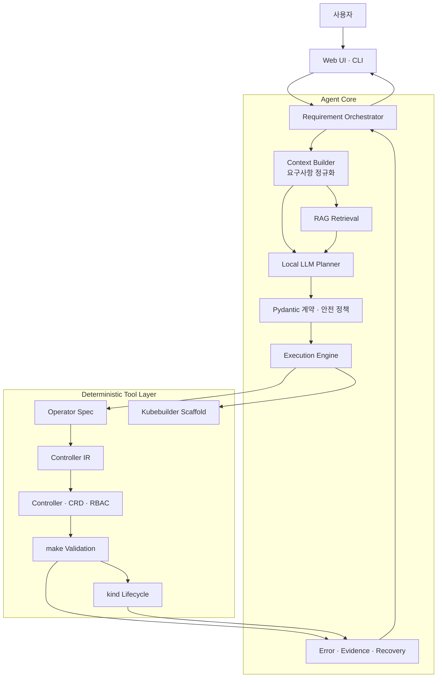
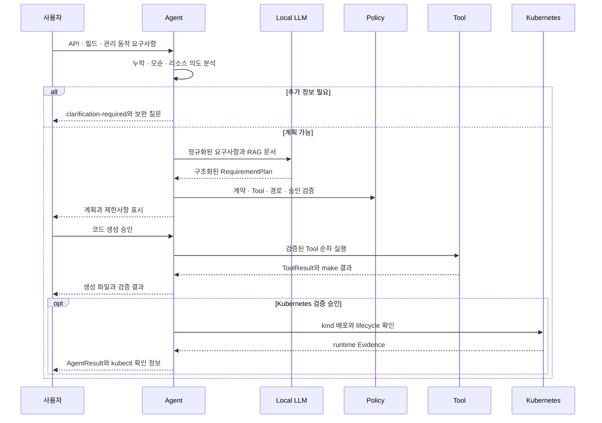
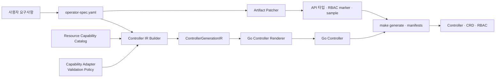

# k8sagent 아키텍처

## 목적

k8sagent는 Operator 요구사항을 이해하는 Local LLM과 실제 프로젝트를 만드는 결정론적 Tool을 분리한 개발지원 시스템입니다. 모델의 출력을 그대로 실행하지 않고, 구조화 계약과 안전 정책을 통과한 작업만 사용자 승인 후 수행합니다.

아키텍처의 핵심 목표는 다음과 같습니다.

- 요구사항 해석과 실제 실행의 책임 분리
- `operator_spec → controller_ir → generated_code` 단방향 생성
- 계획, 코드 생성과 Kubernetes 검증의 승인 경계 분리
- LLM 설명보다 실제 Tool과 runtime Evidence 우선
- Web UI와 CLI가 같은 Agent 계약과 실행 엔진 사용
- 작업별 workspace와 로그 격리

## 전체 구조



## 계층별 책임

| 계층 | 주요 역할 | 대표 코드 |
| --- | --- | --- |
| Interface | 요청 검증, 비동기 작업, 진행 상태와 결과 표시 | `web/`, `agent/cli.py` |
| Orchestration | 요구사항 분석부터 계획·실행·결과 조립까지 전체 흐름 관리 | `requirement_orchestrator.py`, `context_builder.py` |
| AI/RAG | 관련 문서 검색, 누락·위험 요소와 Tool 계획 작성 | `agent/llm/`, `agent/rag/`, `retrieval_context.py` |
| Contract/Policy | LLM 출력, Tool 이름·인자·경로·실행 모드와 승인 상태 검사 | `contracts.py`, `tool_validator.py` |
| Execution | 검증된 Tool 정렬, 순차 실행, 첫 실패 중단과 시간 수집 | `execution_engine.py` |
| Generation | Operator 스펙, scaffold, Controller IR, Go 코드와 RBAC 생성 | `agent/tools/` |
| Validation | make와 kind를 실행하고 lifecycle Evidence 수집 | `tool_runner.py`, `kind_matrix_runner.py` |
| Result/Recovery | 공통 결과 계약, 구조화 오류, 사용자 설명과 복구 계획 생성 | `result_builder.py`, `error_registry.py`, `recovery_orchestrator.py` |

## 요구사항 처리 흐름



필수 정보가 없거나 삭제 정책처럼 요구사항이 모순되면 LLM 계획이나 생성 Tool을 실행하기 전에 중단합니다. 이 상태는 실행 실패가 아니라 사용자 입력을 보완하는 `clarification-required`로 처리합니다.

## 핵심 데이터 계약

Agent 내부와 Web UI는 `agent/contracts.py`의 Pydantic 모델을 공통 계약으로 사용합니다.

| 계약 | 역할 |
| --- | --- |
| `RequirementPlan` | 요구사항 요약, 누락 정보, 계획 단계와 Tool 호출 |
| `ToolCall` | Tool 이름, 실행 모드, 인자, 변경 여부와 승인 요구 |
| `ToolResult` | 명령, stdout/stderr, 종료 코드, 구조화 오류와 배포 결과 |
| `StructuredToolError` | errorCode, 사용자 메시지, 재시도 가능 여부와 UI 심각도 |
| `FailureContext` | 실제 실패 단계와 로그 일부, 이전 성공 단계와 생성 산출물 |
| `RecoveryPlan` | 실패 근거, 제안 조치, 승인받아야 할 재실행 계획 |
| `AgentResult` | 초보자 요약, 기술 세부정보, 검증 결과와 승인 요청을 담는 최종 계약 |

LLM 응답은 목적에 따라 필요한 필드와 타입을 갖춘 `RequirementPlan`, `FinalEvaluation` 또는 `RecoveryPlan`이어야 합니다. Web UI는 LLM 원문을 직접 해석하지 않고, 최종 `AgentResult`를 화면 데이터로 변환합니다.

## Controller 생성 경계



`agent/tools/controller_pipeline.py`는 Operator 스펙을 한 번 IR로 변환한 뒤 Renderer에는 IR만 전달합니다. Renderer가 원본 요구사항이나 예제별 설정을 직접 참조하지 않게 하여 코드 생성 기준이 여러 곳으로 분산되는 것을 막습니다.

IR에는 다음 정보가 포함됩니다.

- 관리·관찰 리소스와 create-or-update/read-only 전략
- spec 필드와 Kubernetes 리소스 필드 매핑
- status 값의 출처
- OwnerReference, retain, finalizer와 삭제 정책
- 리소스별 최소 RBAC
- immutable 필드와 update 정책

새 Kubernetes 리소스는 Resource Capability Catalog에 동작을 정의하고, 필요한 예외만 Adapter와 Validation Policy에 격리합니다. catalog에 없는 리소스는 비슷한 리소스로 대체하지 않고 `CAPABILITY_UNSUPPORTED`로 중단합니다.

## Local LLM과 RAG의 역할

Local LLM은 판단과 설명을 담당합니다.

- 정규화된 요구사항과 검색 문서를 바탕으로 작업 계획 작성
- 누락 정보, 위험 요소와 제한사항 정리
- 실제 Tool 결과를 사용자에게 설명
- 규칙으로 확정할 수 없는 실패의 복구 방향 제안

Local LLM은 셸 명령을 실행하거나 Go Controller 코드를 직접 생성하지 않습니다. 모델이 실패하거나 timeout되더라도 이미 성공한 Tool 결과를 실패로 뒤집지 않으며, 가능한 경우 실제 종료 코드와 검증 결과로 결정론적 요약을 만듭니다.

RAG는 `knowledge-base/`의 Kubernetes·Kubebuilder·오류 대응 문서를 검색합니다. 기본 검색은 keyword와 vector 결과를 결합하고, embedding이나 index를 사용할 수 없으면 keyword 검색으로 전환합니다. 세부 검색 방식과 품질 측정은 [RAG 평가 구조](rag-evaluation.md), 모델 설정은 [Local LLM 사용 정책](local-model-usage-policy.md)에서 설명합니다.

## Tool 실행과 안전 정책

Tool 실행은 다음 원칙을 따릅니다.

1. 기본 계획 단계에서는 변경 Tool을 실제 실행하지 않습니다.
2. LLM이 제안한 Tool은 등록 목록, 필수 인자, 경로와 실행 모드를 검사합니다.
3. 사용자 승인 이후에만 scaffold, 코드 생성과 검증을 실행합니다.
4. 새로운 experimental Capability는 일반 실행 승인과 별도로 확인합니다.
5. Tool은 정해진 순서로 실행하며 첫 실패에서 중단합니다.
6. Recovery는 실제 오류와 로그가 있을 때만 제안하고 자동 실행하지 않습니다.

대표 Tool 순서는 다음과 같습니다.

```text
spec_generator
  → capability_drafter
  → command_planner
  → scaffold_runner
  → artifact_patcher
  → validation
  → optional kind lifecycle
```

`error_registry.py`는 errorCode별 사용자 메시지, 분류, 재시도 가능 여부, Recovery 정책과 UI 심각도를 한곳에서 관리합니다. Docker, kind, kubectl, Ollama 같은 인프라 문제는 생성 코드 실패와 분리합니다.

## 검증 근거와 Capability

검증은 두 단계로 구분됩니다.

| 단계 | 확인 내용 |
| --- | --- |
| make | 코드 생성, CRD/RBAC 생성과 Go 테스트 가능 여부 |
| kind | 생성·변경·drift 복구·status·RBAC·삭제/retain 동작 |

각 lifecycle 항목은 `passed`, `failed`, `not-run`, `not-applicable` 상태로 기록됩니다. `not-run`은 실행하지 않았다는 뜻이므로 성공 Evidence나 Capability 승격 근거로 사용하지 않습니다.

Capability 등급은 새 Custom Resource 이름이 아니라 Kubernetes 리소스와 lifecycle 동작 조합의 Evidence를 기준으로 계산합니다. 검증이 부족한 패턴은 `experimental`로 표시하고 실행 전 별도 확인을 요구합니다.

## Web 작업 격리

Web UI는 Agent CLI를 백그라운드 job으로 실행하므로 Web과 CLI가 같은 계약과 안전 정책을 사용합니다.

```text
logs/web/jobs/<job-id>/
  ├─ artifacts/   # Operator 스펙과 계획
  ├─ workspace/   # Kubebuilder 프로젝트
  ├─ summary.json # Agent 결과
  └─ stdout/stderr
```

각 재시도는 새로운 job ID를 사용해 이전 산출물을 덮어쓰지 않습니다. 코드 생성 job과 kind 검증 job도 분리해 Docker 실패가 이미 성공한 코드 생성 결과를 변경하지 않게 합니다. UI는 SSE 상태 API를 통해 현재 단계, 로그와 경과 시간을 갱신합니다.

## 확장 지점

| 확장 대상 | 변경 위치 |
| --- | --- |
| Kubernetes 관리 리소스 | Resource Capability Catalog, Adapter/Validation Policy, compile/kind fixture |
| Agent Tool | Tool wrapper, 실행 순서, 입력·경로 검증 정책 |
| 오류 코드 | 중앙 Error Registry와 오류 정규화 규칙 |
| 사용자 결과 | `AgentResult` 계약과 Web presenter |
| RAG 문서 | `knowledge-base/`와 RAG 품질 데이터셋 |

새 기능은 LLM prompt만 수정해 추가하지 않습니다. 실행 계약, 결정론적 생성 경로와 검증 Evidence를 함께 추가해야 지원 범위로 인정합니다.
