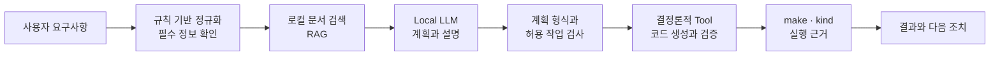

# Local LLM 선택과 사용 방식

## 핵심 특징

k8sagent는 기본적으로 Ollama에서 실행되는 Local LLM을 사용합니다. 사용자가 작성한 Operator 요구사항과 생성 과정의 로그를 외부 AI API에 보내지 않고, 자신의 PC 안에서 처리할 수 있도록 설계했습니다.

이 시스템의 특징은 단순히 모델을 로컬에서 실행하는 데 있지 않습니다. AI 모델의 역할을 **요구사항 해석과 작업 계획**으로 제한하고, 파일 생성·명령 실행·성공 판정은 검증 가능한 코드와 Tool이 담당합니다.



따라서 모델 응답이 달라지거나 모델을 사용할 수 없는 상황이 실제 명령의 무제한 실행이나 근거 없는 성공 판정으로 이어지지 않습니다.

## 왜 로컬 모델을 사용하는가

| 선택 기준 | k8sagent에서 얻는 효과 |
| --- | --- |
| 로컬 처리 | 기본 설정에서는 요구사항, 코드 경로와 실행 로그가 외부 AI 서비스로 전송되지 않음 |
| 독립적인 실행 | 인터넷 연결이나 외부 API 계정 없이 Ollama가 실행되는 개발 환경에서 사용 가능 |
| 예측 가능한 비용 | 외부 API 호출량과 요금에 영향을 받지 않고 반복적인 계획·분석 수행 가능 |
| 실행 통제 | 모델을 셸 실행자가 아닌 제한된 계획 엔진으로 사용해 실제 변경 범위를 코드로 통제 |
| 교체 가능성 | 공통 Ollama endpoint를 사용하므로 환경변수로 모델을 교체하거나 단계별 모델을 다르게 지정 가능 |

기본 endpoint는 `localhost`입니다. `LOCAL_LLM_BASE_URL`을 다른 서버 주소로 변경하면 입력이 해당 서버로 전달되므로, 데이터 처리 범위도 사용자가 설정한 endpoint를 기준으로 달라집니다.

## Qwen 모델 계열을 선택한 이유

이 프로젝트는 기본 Local LLM 계열로 Qwen Coder를 선택했습니다. 다음 조건을 고려한 선택입니다.

- Kubernetes, Go, YAML, JSON 등 개발 용어가 포함된 요청을 다루는 코드 특화 모델 계열입니다.
- 여러 모델 크기를 제공하므로 실행 장비의 CPU·메모리와 원하는 응답 품질에 맞춰 선택할 수 있습니다.
- Ollama에서 로컬로 구동하고 동일한 API 방식으로 모델 크기를 변경할 수 있습니다.
- k8sagent는 전체 Go 코드를 모델에 맡기지 않고 구조화된 계획만 요청하므로, 모델 크기와 실제 코드 생성의 안전성을 분리할 수 있습니다.

모델 크기는 제품 구조가 아니라 실행 환경에 따른 설정입니다. 현재 개발 환경에서는 자원을 고려해 `qwen2.5-coder:3b`을 기본값으로 사용합니다. CPU·메모리 여유가 있는 환경에서는 `qwen2.5-coder:7b`처럼 더 큰 모델을 선택할 수 있고, 빠른 응답이 더 중요한 환경에서는 더 작은 모델을 사용할 수 있습니다.

더 큰 모델이 항상 최종 Operator 품질을 보장하는 것은 아닙니다. 모델은 계획을 제안하고, 최종 품질은 동일하게 실제 빌드·테스트와 Kubernetes 검증 결과로 확인합니다.

```bash
export LOCAL_LLM_BASE_URL=http://localhost:11434/v1
export LOCAL_LLM_MODEL=qwen2.5-coder:3b
```

장비 사양에 맞춰 모델만 변경할 수 있습니다.

```bash
export LOCAL_LLM_MODEL=qwen2.5-coder:7b
```

필요하면 `LOCAL_LLM_PLANNING_MODEL`, `LOCAL_LLM_FINAL_MODEL`, `LOCAL_LLM_RECOVERY_MODEL`, `LOCAL_LLM_LOG_ANALYSIS_MODEL`로 단계별 모델도 다르게 지정할 수 있습니다.

## 모델을 사용하는 단계

| 단계 | 모델의 역할 | 보호 장치 |
| --- | --- | --- |
| 요구사항 계획 | 정규화된 API·필드·동작과 RAG 문서를 바탕으로 누락 정보, 위험과 Tool 순서를 제안 | 필수 정보는 모델 호출 전에도 규칙으로 확인하고, 출력 형식을 검사 |
| 최종 결과 설명 | `standard`와 `full` 실행에서 실제 Tool 결과를 읽고 사용자용 설명을 구성 | 성공 여부는 Tool exit code와 검증 결과가 우선하며, 모델 실패 시 규칙 기반 결과 사용 |
| 실패 로그 분석 | 규칙만으로 분류되지 않은 로그의 원인과 다음 조치를 보완 | 알려진 오류 코드는 모델을 호출하지 않고 Error Registry로 처리 |
| 복구 계획 | 실제 실패 로그와 관련 문서를 바탕으로 수정 방향을 제안 | 복구 작업은 검증 후에도 자동 실행하지 않음 |
| RAG 재정렬 | 선택 옵션 사용 시 검색 문서의 관련도 순서를 보완 | timeout이나 응답 오류 시 기존 검색 점수로 복귀 |

`fast` 실행은 요구사항 계획에는 모델을 사용하지만 최종 결과 설명은 규칙 기반으로 생성합니다. `standard`와 `full`은 실제 Tool 결과를 모델이 한 번 더 정리하되, 그 설명이 실행 증거를 덮어쓰지는 못합니다.

## 모델에 맡기지 않는 작업

다음 작업은 Local LLM이 직접 수행하지 않습니다.

- 임의의 셸 명령, `kubectl`, `make`, `docker`, `kind` 실행
- Go Controller 코드와 RBAC 파일의 자유 형식 생성
- 파일을 쓸 경로와 실행 모드의 최종 결정
- 빌드, 테스트와 Kubernetes lifecycle의 성공 판정
- 실패 후 복구 Tool의 자동 실행
- 과거 오류를 자동으로 학습하거나 지식 문서에 추가하는 작업

실제 코드는 `operator_spec → controller_ir → generated_code` 흐름으로 생성합니다. 모델은 등록된 Tool 이름과 입력값을 포함한 계획만 제안하며, 시스템은 허용된 Tool·경로·모드인지 다시 확인합니다.

## 응답 일관성과 실행 안정성

작은 로컬 모델을 안정적으로 사용하기 위해 다음 장치를 적용합니다.

1. 모델 응답은 자유 문장이 아니라 JSON 객체로 요청합니다.
2. 기본 temperature를 `0`으로 설정해 같은 입력의 표현 편차를 줄입니다.
3. 요구사항, 검색 문서와 실행 결과를 필요한 범위로 줄여 모델 입력을 구성합니다.
4. 계획에 필수 항목이 빠지면 잘못된 부분을 알려 한 번만 형식 수정을 요청합니다.
5. 수정 후에도 형식이 맞지 않으면 Tool을 실행하지 않고 실패로 처리합니다.
6. 단계별 timeout과 최대 출력 길이를 분리해 로그 분석 같은 보조 작업이 전체 흐름을 오래 막지 않게 합니다.
7. 동일한 계획은 cache로 재사용하되 prompt, 출력 구조, Tool 정의 또는 모델이 바뀌면 기존 cache를 무효화합니다.

계획 cache는 기본적으로 다음 위치에 저장됩니다.

```text
.cache/agent/llm-plans/<hash>.json
```

```bash
--no-cache       # cache를 사용하지 않고 매번 모델 호출
--refresh-cache  # 기존 결과를 무시하고 새 계획 저장
```

cache는 반복 실행 시간을 줄이기 위한 장치이며 학습이나 장기 기억이 아닙니다. 이전 오류와 사용자 입력이 자동으로 다음 요청의 모델 지식이 되지는 않습니다.

## 모델 장애 시 동작

Local LLM 연결 실패를 Operator 코드 실패로 취급하지 않습니다.

| 상황 | 동작 |
| --- | --- |
| 최초 요구사항 계획에서 모델 연결 실패 | `OLLAMA_UNAVAILABLE` 등 인프라 오류로 중단하고 Tool을 실행하지 않음 |
| 최종 결과 설명 실패 | 실제 Tool 결과로 규칙 기반 요약을 생성하며 성공·실패 근거는 유지 |
| 알려진 실행 오류 | 모델 없이 Error Registry의 오류 코드, 사용자 메시지와 다음 조치 사용 |
| 알 수 없는 로그 분석 실패 | 확인된 로그 근거만 표시하고 임의 원인을 만들지 않음 |
| 선택적 RAG 재정렬 실패 | keyword/vector 검색 점수 기반 순서로 복귀 |

이 구조는 모델을 사용할 수 있을 때는 자연어 이해와 설명의 장점을 활용하고, 사용할 수 없을 때도 이미 확보된 실행 결과를 왜곡하지 않도록 합니다.

## 확인할 수 있는 실행 기록

Agent 작업 디렉터리에는 사용한 모델과 입력·출력, cache 여부와 단계별 시간이 기록됩니다.

| 파일 | 확인 내용 |
| --- | --- |
| `llm-input.json` | 모델에 전달한 구조화 입력 |
| `llm-output.json` | 형식 검사를 거친 작업 계획 |
| `llm-raw-output.txt` | 모델의 원문 응답 |
| `planner-cache.json` | cache 사용 여부와 식별 정보 |
| `timings.json` | RAG, 모델 계획, Tool 실행과 결과 설명 소요 시간 |
| `safety-evaluation.json` | 계획된 Tool이 실행 조건을 통과했는지 여부 |
| `evidence-trace.json` | 검색 문서, 모델 판단과 실제 Tool 결과의 연결 관계 |

이 기록을 통해 “AI가 그렇게 판단했다”는 설명에 그치지 않고, 어떤 입력과 근거를 사용했고 실제 실행 결과가 무엇인지 분리해 확인할 수 있습니다.

## 현재 제한사항

- 로컬 모델의 응답 시간은 CPU, 메모리와 모델 로딩 상태에 영향을 받습니다.
- 모든 자연어 표현을 정확하게 이해하는 것은 아니므로 API, 필드 타입, 관리 대상과 삭제 방식이 명확할수록 안정적입니다.
- 현재 기본 모델 크기는 개발 장비를 고려한 설정이며, 특정 크기의 모델이 다른 모델보다 항상 우수하다는 의미가 아닙니다.
- Local LLM은 자동 학습하지 않습니다. 반복되는 오류를 제품 지식으로 반영하려면 검토 후 Error Registry, knowledge-base 또는 회귀 fixture를 수정해야 합니다.
