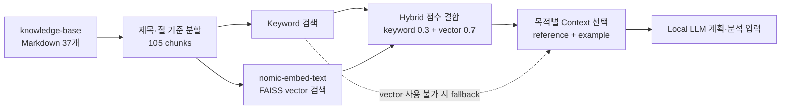

# RAG 검색 구조와 검증 결과

## RAG를 사용하는 이유

k8sagent의 Local LLM은 학습된 일반 지식만으로 Operator 계획을 만들지 않습니다. 사용자 요구사항이나 실패 로그와 관련된 문서를 `knowledge-base/`에서 먼저 찾고, 선택된 문서를 모델 입력에 함께 제공합니다.

RAG의 역할은 다음과 같습니다.

- Kubebuilder 프로젝트 생성, API 설계와 Reconcile 같은 개발 절차를 계획에 연결합니다.
- RBAC, ownerReference, finalizer와 status 같은 Kubernetes 규칙을 찾습니다.
- `make generate`, `forbidden`, `ImagePullBackOff` 같은 오류에 맞는 확인 순서를 제공합니다.
- 기존 Operator 사례와 현재 요구사항이 유사한지 판단할 문맥을 제공합니다.

RAG 문서는 참고 문맥이며 실행 명령이나 성공 판정이 아닙니다. 검색 결과가 있어도 계획 형식과 허용 작업을 다시 검사하며, 최종 성공 여부는 실제 Tool·빌드·Kubernetes 검증 결과로 판단합니다.

## 전체 검색 흐름



Markdown은 제목과 절을 기준으로 최대 900자, 120자 overlap으로 분할합니다. 180자보다 짧은 내용은 인접 내용과 합쳐 지나치게 작은 chunk가 검색되는 것을 줄입니다.

Vector 검색은 Ollama의 `nomic-embed-text`와 FAISS `IndexFlatIP`를 사용합니다. 임베딩을 정규화한 뒤 유사도를 계산하며, Knowledge Base 파일 hash가 달라지면 index를 다시 생성합니다.

기본 Hybrid 검색은 정규화한 vector 점수 70%와 keyword 점수 30%를 합칩니다. Vector index나 embedding model을 사용할 수 없으면 keyword 검색으로 전환하고, fallback 여부와 원인을 실행 기록에 남깁니다.

## Knowledge Base 구성

2026-07-17 기준 Knowledge Base는 37개 문서, 105개 chunk로 구성됩니다.

| 경로 | 문서 수 | 내용 |
| --- | ---: | --- |
| `knowledge-base/kubebuilder-guides/` | 14 | 프로젝트 초기화, API·CRD, spec/status, Reconcile, RBAC, watch, finalizer, make와 kind 검증 |
| `knowledge-base/troubleshooting/` | 14 | 코드 생성, CRD, RBAC, envtest, 이미지, PVC, conflict와 webhook 오류의 증상·원인·조치 |
| `knowledge-base/examples/` | 9 | ConfigMap, Deployment·Service, Job, StatefulSet, Secret 동기화와 복구 사례 |

이 문서들은 외부 문서를 그대로 저장한 복사본이 아닙니다. 공식 문서의 개념과 프로젝트에서 확인한 실행 결과를 k8sagent의 검색 목적에 맞게 짧은 Markdown으로 다시 작성한 `internal-authored` 자료입니다.

### 작성 기준과 출처

| Knowledge Base 영역 | 기준 출처 | 반영 내용 |
| --- | --- | --- |
| 프로젝트와 API 생성 | [Kubebuilder Quick Start](https://book.kubebuilder.io/quick-start.html) | `kubebuilder init`, `create api`, API 타입, CRD와 manifest 생성 흐름 |
| Reconcile과 status | [Kubebuilder Controller 구현](https://book.kubebuilder.io/cronjob-tutorial/controller-implementation), [controller-runtime Reconcile](https://pkg.go.dev/sigs.k8s.io/controller-runtime/pkg/reconcile) | 원하는 상태와 실제 상태 비교, 하위 리소스 조회, status 갱신과 재실행 구조 |
| watch와 소유 리소스 | [controller-runtime Builder](https://pkg.go.dev/sigs.k8s.io/controller-runtime/pkg/builder) | `For`, `Owns`, `Watches`를 이용한 이벤트와 Reconcile 연결 |
| RBAC | [Kubebuilder RBAC markers](https://book.kubebuilder.io/reference/markers/rbac), [Kubernetes RBAC](https://kubernetes.io/docs/reference/access-authn-authz/rbac/) | Controller marker, API group·resource·verb와 최소 권한 구성 |
| Custom Resource와 CRD | [Kubernetes Custom Resources](https://kubernetes.io/docs/concepts/extend-kubernetes/api-extension/custom-resources/), [CustomResourceDefinition](https://kubernetes.io/docs/tasks/extend-kubernetes/custom-resources/custom-resource-definitions/) | Custom Resource, schema, status subresource와 validation 개념 |
| 삭제와 소유권 | [Kubernetes Owners and Dependents](https://kubernetes.io/docs/concepts/overview/working-with-objects/owners-dependents/), [Kubernetes Finalizers](https://kubernetes.io/docs/concepts/overview/working-with-objects/finalizers/) | ownerReference, garbage collection, retain과 외부 정리 정책 구분 |
| 테스트 환경 | [Kubebuilder EnvTest](https://book.kubebuilder.io/reference/envtest), [kind Quick Start](https://kind.sigs.k8s.io/docs/user/quick-start/) | `make test` 환경과 로컬 Kubernetes lifecycle 검증 |
| 제품 내부 사례 | `requirements/`, `evaluation/fixtures/`, 구조화 오류 코드와 kind 실행 결과 | 실제 지원하는 Operator 패턴, 실패 분류, 복구 제한과 환경 오류 사례 |

공식 문서는 개념의 기준으로 사용하고, k8sagent 전용 Tool 이름·실행 순서·errorCode·검증 정책은 저장소 코드와 회귀 결과를 기준으로 작성합니다. 따라서 공식 문서 내용과 제품 고유 동작을 한 출처처럼 섞지 않습니다.

## 검색 모드

| Mode | 방식 | 용도 |
| --- | --- | --- |
| `keyword` | 질의와 Markdown에 함께 등장하는 단어 수로 정렬 | 빠른 회귀, vector 장애 시 fallback |
| `vector` | `nomic-embed-text` 임베딩의 의미 유사도로 정렬 | 표현이 달라도 의미가 가까운 문서 검색 |
| `hybrid` | vector 70%와 keyword 30%를 결합 | 현재 기본 검색 모드 |
| `hybrid-rerank` | Hybrid 후보를 Local LLM이 한 번 더 정렬 | 선택적 비교 모드, 기본 비활성 |

기본 설정은 다음과 같습니다.

```bash
export RAG_MODE=hybrid
export RAG_RERANK_ENABLED=false
export LOCAL_EMBEDDING_MODEL=nomic-embed-text
```

Local LLM reranker는 검색 품질을 추가로 비교할 때만 사용합니다. 모델 응답 시간과 timeout이 전체 계획 시간을 늘릴 수 있어 기본 흐름에서는 사용하지 않으며, 실패하면 Hybrid 점수 순서로 복귀합니다.

## Agent에 전달할 문서 선택

검색 결과 전체를 모델에 보내지 않습니다. 같은 문서의 여러 chunk를 제거하고, 작업 목적에 따라 최대 3개만 선택합니다.

| 사용 목적 | 우선 선택 |
| --- | --- |
| Operator 요구사항 계획 | guide/troubleshooting reference 최대 2개 + example 최대 1개 |
| 실패 복구와 로그 분석 | troubleshooting/guide reference 최대 2개 + recovery example 최대 1개 |

실제 기본 요구사항 계획의 문서 수는 `AGENT_REQUIREMENT_RAG_LIMIT`으로 1~3개 사이에서 조정하며 기본값은 2개입니다. 선택 결과에는 `sourcePath`, `contextType`, 선택 이유를 기록합니다.

## 평가 데이터셋

[evaluation/rag-evaluation-dataset.yaml](../evaluation/rag-evaluation-dataset.yaml)은 사람이 관련 문서를 지정한 25개 질의로 구성됩니다.

| 분류 | 질의 수 | 예시 |
| --- | ---: | --- |
| requirement | 7 | ConfigMap, GPU Job, StatefulSet·Service, Secret 동기화, 웹 서비스 |
| generation | 5 | status, finalizer, spec/status, ownership/watch, validation marker |
| validation | 4 | `make generate`, `make manifests`, kind와 전체 make 성공 의미 |
| troubleshooting | 8 | 잘못된 Go 타입, controller-gen, RBAC, PVC, 이미지와 conflict |
| environment-warning | 1 | GPU가 없는 kind에서 발생하는 Pending 상태 |

각 항목은 검색 문장인 `query`, 정답으로 간주할 `expectedSources`, 평가 의도를 설명하는 `notes`를 가집니다. 정답 문서는 단순 키워드 일치가 아니라 해당 질의에 직접적인 설명이나 조치를 제공하는지를 기준으로 지정했습니다.

## 평가 지표의 의미

| 지표 | 확인하는 내용 |
| --- | --- |
| Hit@1 | 첫 번째 문서가 관련 문서인 질의의 비율 |
| Hit@3 | 상위 3개 안에 관련 문서가 하나 이상 있는 질의의 비율 |
| Recall@3 / Recall@5 | 질의별 정답 문서 중 상위 3개/5개에서 찾은 비율의 평균 |
| MRR | 첫 관련 문서가 얼마나 앞에 있는지 나타내는 reciprocal rank 평균 |
| Avg / P95 Latency | 평균 검색 시간과 느린 상위 구간의 검색 시간 |
| Fallback Count | Vector 또는 Hybrid 실패 후 keyword로 전환한 횟수 |
| Reranker Timeout Count | 선택적 Local LLM 재정렬이 시간 초과한 횟수 |

k8sagent는 모델에 최대 3개의 서로 다른 문서를 제공하므로 Hit@1만큼 Hit@3와 Recall@3를 중요하게 봅니다. 첫 문서 하나가 맞는 것보다 관련 guide와 example이 함께 포함되는 것이 계획의 근거를 구성하는 데 유리하기 때문입니다.

## 최신 전체 검색 비교

다음 결과는 2026-07-17에 현재 `main`의 Knowledge Base와 25개 전체 질의를 다시 측정한 값입니다.

측정 조건:

- WSL2, Intel Core i7-1165G7 4코어/8스레드, 할당 메모리 7.6GiB
- Knowledge Base 37개 문서, 105개 chunk
- Ollama `nomic-embed-text`, 768차원 embedding
- 결과 제한 5개, Local LLM reranker 비활성
- index를 현재 문서로 다시 생성한 뒤 같은 프로세스에서 순차 측정

| Mode | Hit@1 | Hit@3 | Recall@3 | Recall@5 | MRR | 평균 | P95 | Fallback |
| --- | ---: | ---: | ---: | ---: | ---: | ---: | ---: | ---: |
| keyword | 0.60 | 0.92 | 0.6400 | 0.7267 | 0.7500 | 0.0037초 | 0.0046초 | 0 |
| vector | 0.80 | 0.96 | 0.6267 | 0.7667 | 0.8833 | 0.0673초 | 0.0734초 | 0 |
| **hybrid** | 0.72 | **1.00** | **0.7067** | **0.8000** | 0.8533 | 0.0617초 | 0.0742초 | 0 |

Vector는 Hit@1과 MRR이 가장 높았고, Hybrid는 25개 모든 질의에서 관련 문서를 상위 3개 안에 포함하면서 Recall@3와 Recall@5가 가장 높았습니다. k8sagent가 여러 reference와 example을 함께 선택하는 구조이므로, 현재 기본값은 Hybrid가 적절하다고 판단했습니다.

이 수치는 해당 장비와 현재 25개 데이터셋의 결과이며 모든 질의에 대한 일반적인 성능을 보장하지 않습니다. 특히 latency는 하드웨어, Ollama 상태와 index cache의 영향을 받습니다.

### 상시 Quick gate

Quick 회귀에서는 Ollama와 FAISS 없이 실행할 수 있도록 requirement 분류 7개만 keyword 검색과 실제 Context 선택 정책으로 검사합니다.

2026-07-17 측정값:

| 항목 | 기준 | 결과 |
| --- | ---: | ---: |
| Hit@3 | 0.80 이상 | **1.00** |
| Recall@3 | 0.45 이상 | **0.5952** |
| MRR | 0.50 이상 | **0.6190** |

Quick gate의 latency는 실제 성능 측정 대상이 아닙니다. 전체 25개 모드 비교와 달리 검색 품질 회귀를 빠르게 차단하는 용도로 사용합니다.

## 현재 결과에서 확인된 약점

평균 지표만으로 약한 질의를 숨기지 않기 위해 질의별 결과도 함께 저장합니다.

- Keyword 검색에서는 `ImagePullBackOff` 전용 문서가 4위였고, make 세 단계의 성공 의미를 묻는 질의는 관련 문서를 상위 5개에서 찾지 못했습니다.
- Hybrid는 모든 질의에서 관련 문서 하나 이상을 상위 3개에 포함했지만, status 갱신·전체 make 검증·cross-namespace Secret 질의의 Recall@3는 각각 0.3333이었습니다.
- Vector 결과에는 같은 문서의 서로 다른 chunk가 함께 포함될 수 있습니다. 실제 Agent Context 선택에서는 source path 기준으로 중복 문서를 제거하지만, 평가기의 raw vector 순위에서는 이 특성이 Recall에 반영됩니다.
- `hybrid-rerank`는 기본 비활성이고 이번 기준선에서 측정하지 않았습니다. 따라서 위 결과만으로 Local LLM reranker의 개선 효과를 주장하지 않습니다.

향후에는 약한 세 질의의 문서 제목·본문 표현을 보완하고, 한국어 축약·부정문·복합 리소스 오류 질의를 데이터셋에 추가한 뒤 같은 조건으로 다시 비교합니다.

## 재현 방법

전체 Keyword·Vector·Hybrid 비교:

```bash
./scripts/evaluate-rag.sh
```

위 스크립트는 현재 Markdown으로 FAISS index를 다시 만들고 평가 결과를 `evaluation/results/<timestamp>/`에 생성합니다.

Quick gate만 실행:

```bash
python3 agent/evaluation/rag_quality_gate.py \
  --output /tmp/k8sagent-rag-quality.json
```

Local LLM reranker를 별도로 비교하려면 다음과 같이 실행합니다.

```bash
RAG_EVALUATION_MODES=hybrid-rerank \
RAG_RERANK_ENABLED=true \
LOCAL_LLM_TIMEOUT_SECONDS=120 \
./scripts/evaluate-rag.sh
```

## 생성되는 결과 파일

| 파일 | 내용 |
| --- | --- |
| `evaluation-summary.json` | 문서·chunk 수와 모드별 집계 지표 |
| `evaluation-details.json` | 모든 모드의 질의별 결과 |
| `keyword-results.json` | Keyword 질의별 순위와 지표 |
| `vector-results.json` | Vector 질의별 순위와 지표 |
| `hybrid-results.json` | Hybrid 질의별 순위와 지표 |
| `hybrid-rerank-results.json` | 선택적으로 실행한 reranker 결과 |
| `rag-evaluation-report.md` | 사람이 읽는 표 형식의 요약 |

평가 결과는 실행 시점별 로컬 산출물이며 Git에 계속 누적하지 않습니다. 문서에 수치를 갱신할 때는 측정일, 데이터셋 크기, Knowledge Base hash에 영향을 주는 변경과 실행 조건을 함께 기록합니다.
