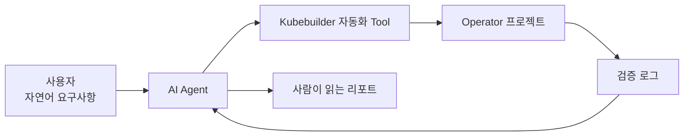
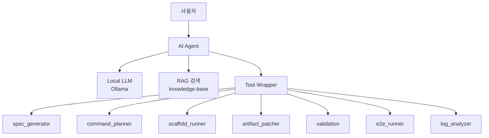
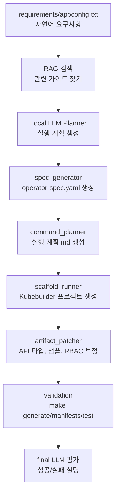
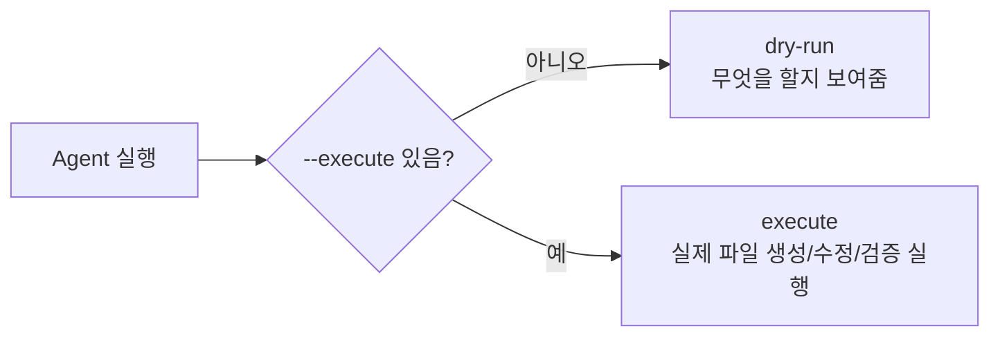
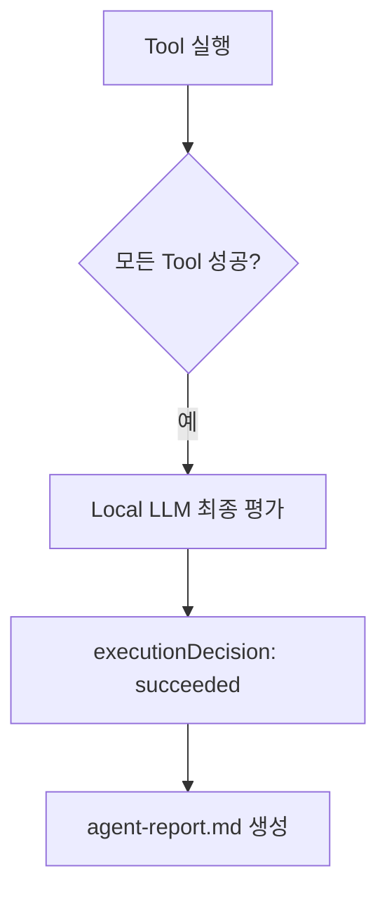
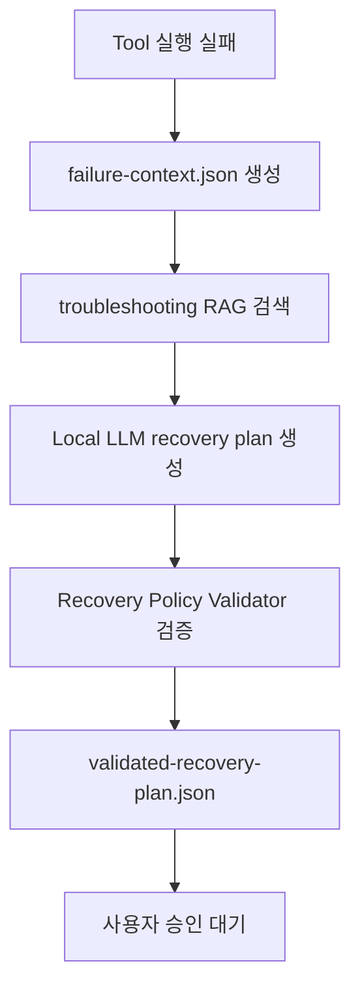

# 그림 중심 전체 흐름 설명

이 문서는 전체 구조를 처음 이해하기 위한 그림 중심 설명입니다.
세부 명령어보다 “누가 무엇을 하고, 결과가 어디에 생기는지”를 먼저 잡는 것이 목적입니다.

## 1. 이 시스템이 하는 일



쉽게 말하면 이렇습니다.

```text
내가 만들고 싶은 Operator를 글로 쓴다.
AI Agent가 그 글을 읽고 개발 순서를 만든다.
자동화 Tool이 실제 Kubebuilder 작업을 수행한다.
검증 결과와 오류 로그를 다시 AI Agent가 읽는다.
마지막에 성공 여부와 다음 조치를 설명한다.
```

## 2. 주요 등장인물



| 구성요소 | 쉽게 말하면 | 실제 역할 |
| --- | --- | --- |
| 사용자 | 만들고 싶은 것을 말하는 사람 | 자연어 요구사항 작성 |
| AI Agent | 전체 진행 관리자 | LLM, RAG, Tool 실행 순서 관리 |
| Local LLM | 판단하는 두뇌 | 요구사항 요약, 계획 생성, 결과 설명 |
| RAG 검색 | 참고 문서 찾기 | Kubebuilder 가이드, 오류 해결 문서 검색 |
| Tool Wrapper | 안전한 실행 관리자 | 허용된 Tool만 실행 |
| 자동화 Tool | 실제 작업자 | spec 생성, scaffold, patch, 검증 |

## 3. 자연어 요구사항이 Operator 프로젝트가 되는 과정



각 단계의 결과물은 다음 위치에 생깁니다.

| 단계 | 결과물 |
| --- | --- |
| 자연어 요구사항 | `requirements/*.txt` |
| 구조화 스펙 | `generated/*-operator-spec.yaml` |
| 실행 계획 | `generated/*-command-plan.md` |
| Kubebuilder 프로젝트 | `workspace/generated-operators/*` |
| Agent 리포트 | `logs/agent/<timestamp>/agent-report.md` |
| Tool 실행 결과 | `logs/agent/<timestamp>/tool-results.json` |

## 4. dry-run과 execute 차이

가장 중요한 안전장치입니다.



| 모드 | 의미 | 실제 변경 |
| --- | --- | --- |
| `--mode dry-run` | 계획과 실행 예정 명령을 확인 | 거의 없음 |
| `--mode execute --execute` | 실제 scaffold, patch, validation 수행 | 있음 |

초보자라면 항상 dry-run으로 먼저 확인하는 것이 좋습니다.

```bash
python3 agent/langchain_agent.py \
  --requirement requirements/appconfig.txt \
  --profile profiles/appconfig.yaml \
  --mode dry-run
```

## 5. 성공했을 때 흐름



성공하면 주로 아래 파일을 보면 됩니다.

```text
logs/agent/<timestamp>/agent-report.md
logs/agent/<timestamp>/summary.json
logs/agent/<timestamp>/final-llm-output.json
```

## 6. 실패했을 때 흐름



중요한 점:

```text
실패 복구 계획은 자동 실행하지 않습니다.
Agent는 무엇을 고쳐야 하는지 제안만 하고,
실제 수정은 사용자 승인 이후에만 진행합니다.
```

예를 들어 `brokenValue:notatype` 같은 잘못된 타입이 있으면 다음처럼 판단합니다.

```text
classification: invalid-field-type
rootCause: brokenValue field uses unsupported type: notatype
복구 순서:
  1. requirement_editor
  2. spec_generator
  3. artifact_patcher
  4. validation
상태:
  waiting-for-user-approval
```

## 7. 지금 바로 이해용으로 실행해볼 명령

가장 안전한 확인 명령입니다.

```bash
python3 agent/langchain_agent.py \
  --requirement requirements/appconfig.txt \
  --profile profiles/appconfig.yaml \
  --mode dry-run
```

실행 후 이 파일을 보면 됩니다.

```text
logs/agent/<timestamp>/agent-report.md
```

이 리포트에서 먼저 볼 부분은 다음입니다.

| 볼 부분 | 의미 |
| --- | --- |
| Requirement Summary | 사용자의 요구사항을 AI가 어떻게 이해했는지 |
| Retrieved Knowledge | 어떤 문서를 참고했는지 |
| Tool Call Plan From LLM | 어떤 작업 순서로 진행하려는지 |
| Tool Execution Results | 실제 Tool이 성공했는지 |
| Beginner Summary | 초보자용 요약 |

## 8. 한 줄 요약

```text
이 프로젝트는 “Operator 개발 절차를 아는 AI 진행자”와
“실제 Kubebuilder 작업을 수행하는 자동화 Tool”을 연결한 구조입니다.
```

