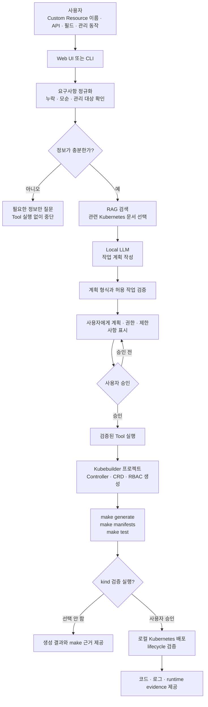
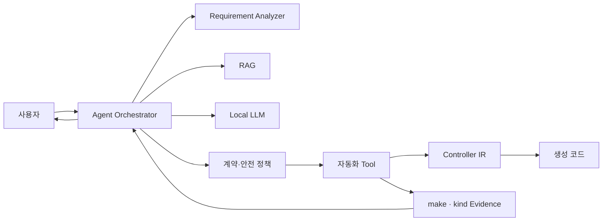
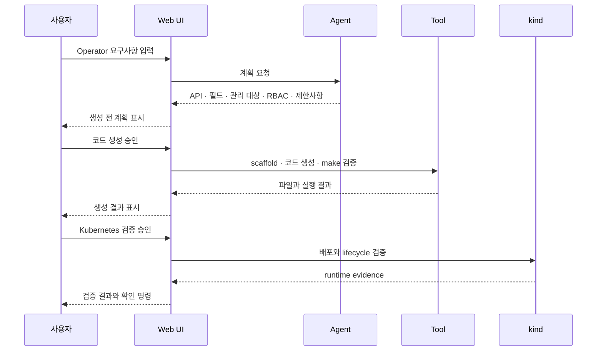
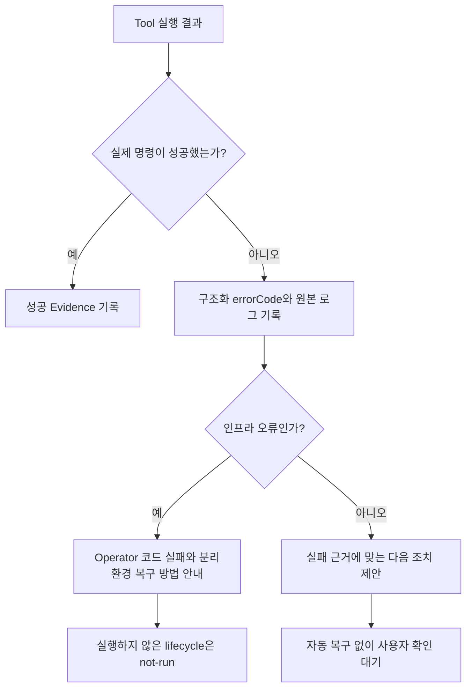

# k8sagent 시각적 동작 개요

이 문서는 k8sagent가 Operator 요구사항을 받아 계획을 만들고, 사용자 승인 후 코드와 검증 근거를 생성하는 과정을 그림으로 설명합니다.

## 전체 흐름


```mermaid
flowchart TD
    U["사용자<br/>Custom Resource 이름 · API · 필드 · 관리 동작"] --> UI["Web UI 또는 CLI"]
    UI --> N["요구사항 정규화<br/>누락 · 모순 · 관리 대상 확인"]
    N --> Q{"정보가 충분한가?"}
    Q -->|아니오| C["필요한 정보만 질문<br/>Tool 실행 없이 중단"]
    Q -->|예| R["RAG 검색<br/>관련 Kubernetes 문서 선택"]
    R --> L["Local LLM<br/>작업 계획 작성"]
    L --> P["계획 형식과 허용 작업 검증"]
    P --> V["사용자에게 계획 · 권한 · 제한사항 표시"]
    V --> A{"사용자 승인"}
    A -->|승인 전| V
    A -->|승인| T["검증된 Tool 실행"]
    T --> G["Kubebuilder 프로젝트<br/>Controller · CRD · RBAC 생성"]
    G --> M["make generate<br/>make manifests<br/>make test"]
    M --> K{"kind 검증 실행?"}
    K -->|선택 안 함| O["생성 결과와 make 근거 제공"]
    K -->|사용자 승인| D["로컬 Kubernetes 배포<br/>lifecycle 검증"]
    D --> O2["코드 · 로그 · runtime evidence 제공"]
```

사용자는 처음부터 셸 명령이나 Go 코드를 작성하지 않습니다. 먼저 요구사항을 설명하고 Agent가 이해한 계획을 확인합니다. 실제 파일 생성과 Kubernetes 검증은 각각 사용자 승인 이후에만 진행됩니다.

## 구성요소별 책임


```mermaid
flowchart LR
    U["사용자"] --> A["Agent Orchestrator"]
    A --> R["Requirement Analyzer"]
    A --> K["RAG"]
    A --> L["Local LLM"]
    A --> S["계약·안전 정책"]
    S --> T["자동화 Tool"]
    T --> I["Controller IR"]
    I --> G["생성 코드"]
    T --> E["make · kind Evidence"]
    E --> A
    A --> U
```

| 구성요소 | 담당하는 일 | 담당하지 않는 일 |
| --- | --- | --- |
| Requirement Analyzer | API, spec/status, 관리·관찰 리소스, 삭제 정책 정규화 | 불명확한 값을 임의로 확정하지 않음 |
| RAG | 로컬 knowledge-base에서 관련 개발·오류 문서 검색 | 검색 문서를 명령처럼 실행하지 않음 |
| Local LLM | 누락 정보, 위험 요소와 Tool 실행 계획 작성 | 셸 명령과 Go 코드를 직접 실행하지 않음 |
| 계약·안전 정책 | 계획 형식, Tool 종류, 입력값, 경로와 승인 상태 검사 | 허용되지 않은 작업을 대체 실행하지 않음 |
| 자동화 Tool | 스펙, Kubebuilder scaffold, Controller, CRD, RBAC 생성과 검증 | LLM의 자유 형식 명령을 실행하지 않음 |
| Evidence 수집 | make와 kind의 실제 결과, 오류 코드와 lifecycle 상태 기록 | 실행하지 않은 항목을 성공으로 기록하지 않음 |

핵심 경계는 다음과 같습니다.

```text
operator_spec → controller_ir → generated_code
```

Local LLM은 어떤 작업이 필요한지 계획하지만, Controller 코드는 구조화된 Operator 스펙과 Controller IR을 기준으로 생성됩니다. 따라서 같은 의미의 요구사항은 가능한 한 동일한 코드 생성 경로를 사용합니다.

## 사용자 승인 단계


```mermaid
sequenceDiagram
    participant U as 사용자
    participant W as Web UI
    participant A as Agent
    participant T as Tool
    participant K as kind

    U->>W: Operator 요구사항 입력
    W->>A: 계획 요청
    A-->>W: API · 필드 · 관리 대상 · RBAC · 제한사항
    W-->>U: 생성 전 계획 표시
    U->>W: 코드 생성 승인
    W->>T: scaffold · 코드 생성 · make 검증
    T-->>W: 파일과 실행 결과
    W-->>U: 생성 결과 표시
    U->>W: Kubernetes 검증 승인
    W->>K: 배포와 lifecycle 검증
    K-->>W: runtime evidence
    W-->>U: 검증 결과와 확인 명령
```

승인은 두 번 분리됩니다.

1. 코드 생성 승인: Kubebuilder 프로젝트와 코드를 만들고 make 검증을 수행합니다.
2. Kubernetes 검증 승인: Docker/kind 환경에서 Operator를 배포하고 lifecycle을 확인합니다.

## 성공과 실패의 판정


```mermaid
flowchart TD
    T["Tool 실행 결과"] --> Q{"실제 명령이 성공했는가?"}
    Q -->|예| E["성공 Evidence 기록"]
    Q -->|아니오| X["구조화 errorCode와 원본 로그 기록"]
    X --> I{"인프라 오류인가?"}
    I -->|예| F["Operator 코드 실패와 분리<br/>환경 복구 방법 안내"]
    I -->|아니오| R["실패 근거에 맞는 다음 조치 제안"]
    F --> N["실행하지 않은 lifecycle은 not-run"]
    R --> H["자동 복구 없이 사용자 확인 대기"]
```

최종 성공 여부는 Local LLM의 설명이 아니라 실제 Tool의 종료 코드와 검증 결과로 결정합니다. Docker daemon 연결 실패처럼 실행 환경의 문제는 Operator 코드 오류와 분리하며, 실행되지 않은 lifecycle 항목은 Capability 근거로 사용하지 않습니다.

필수 정보가 없거나 요구사항이 서로 모순되는 경우에도 생성 Tool을 실행하지 않습니다. 이때는 임의 값을 정하거나 근거 없는 오류를 만들지 않고, 사용자가 보완해야 할 내용만 표시합니다.

## 생성되는 결과

| 실행 방식 | 주요 위치 | 내용 |
| --- | --- | --- |
| Web UI | `logs/web/jobs/<job-id>/artifacts/` | Operator 스펙, 계획, Capability 정보 |
| Web UI | `logs/web/jobs/<job-id>/workspace/` | 생성된 Kubebuilder 프로젝트 |
| Web UI | `logs/web/jobs/<job-id>/` | 작업 상태, stdout/stderr, 결과 요약 |
| CLI | `generated/` | Operator 스펙과 계획 |
| CLI | `workspace/` | 생성된 Kubebuilder 프로젝트 |
| CLI | `logs/agent/<timestamp>/` | Agent 입력·출력, Tool 결과와 Evidence |

결과 화면에서는 다음 내용을 우선 확인합니다.

- Agent가 이해한 Custom Resource와 관리 대상
- 생성된 Controller, API 타입과 RBAC 파일
- `make generate`, `make manifests`, `make test` 결과
- kind를 실행했다면 생성·변경·drift 복구·삭제 정책 Evidence
- 실패했다면 구조화 오류 코드, 실제 실패 단계와 다음 조치

## 한 줄 요약

> k8sagent는 Local LLM의 계획 능력과 검증된 코드 생성 Tool을 분리하고, 사용자 승인과 실제 실행 Evidence를 통해 Operator 개발 과정을 안전하게 연결합니다.
